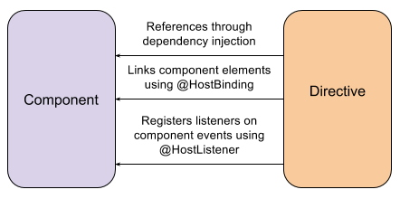
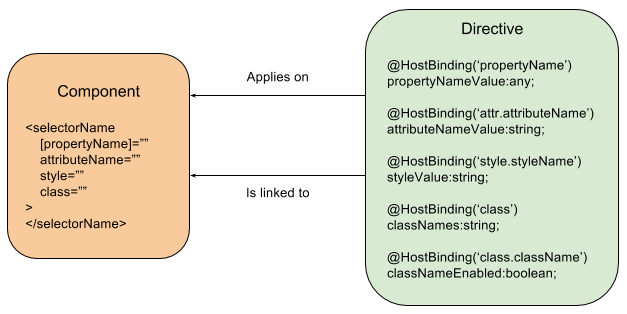

https://medium.com/@ttemplier/component-composition-in-angular2-part-1-33f50f402906#.shhb731k7

# component / directive composition 组成
Angular 2 有3种指令：
* Components，指令带有定义在模板的内容，最常用
* Attribute directives，用来改变 DOM 元素 或 component 的行为或展示
* Structural directives，通过增加和删除 DOM 元素，改变 DOM 的布局，它们被连接到模板元素

# 定义 attribute directives
attribute directive 用来改变 DOM 元素 或 component 的行为或展示，所以它们一般作用于
已存在的元素，或者基于 selectors 的 component。
 
下面是个例子
```typescript
@Directive({
})
export class SomeAttributeDirective {
    constructor(private elementRef:ElementRef) {}

    ngOnInit() {}

    ngAfterViewInit() {}
}
```
constructor 里定义的 ElementRef实例，对应了含有这个指令的元素，
和 components 一样，我们可以添加  inputs and outputs。
Attribute directives 声明周期和所在 components 一致。
 
# 实现 attribute directives
有2种方式
* transparent，基于一个 HTML 元素或属性，无需额外的附加信息。 Angular 2在Forms 使用：
指令附加加在form 和 form 元素(input, select, text area).之下
* explicit，实现指令，必需附加一个元素属性，例如表单里的 required 属性。

我们来看一个选择器是 `comp` 的 component 的例子，第一个例子里使用 transparent 类型，
directive 使用相同的选择器，并会在 comp 的 HTML 元素使用时，自动实现。 
```typescript
@Directive({
  selector: 'comp'
})
export class SomeDirective {}

@Component({
  selector: 'comp',
  template: `
    <div>Component template</div>
  `,
  directives: [ SomeDirective ]
})
export class SomeComponent {}

@Component({
  template: `
    <!-- The directive is applied -->
    <comp></comp>
  `,
  Directives: [ SomeComponent, SomeDirective ]
})
export class AppComponent {}
```

如果 directive 是 explicit 类型的，选择器现在变成 `comp[applied]`
```typescript
@Directive({
  selector: 'comp[applied]'
})
export class SomeDirective {}

@Component({
  selector: 'comp',
  template: `
    <div>Component template</div>
  `,
  directives: [ SomeDirective ]
})
export class SomeComponent {}

@Component({
  template: `
    <!-- The directive isn’t applied -->
    <comp></comp>
    <!-- The directive is applied -->
    <comp applied></comp>
  `,
  directives: [ SomeComponent, SomeDirective ]
})
export class AppComponent {}
```

# Linking and updating the host component
from https://angular.io/docs/ts/latest/guide/cheatsheet.html

Class field decorators for directives and components | description
---- | ---
@HostBinding('[class.valid]') isValid|Binds a host element property (here, the CSS class valid) to a directive/component property (isValid).
@HostListener('click', ['$event']) onClick(e) {...}|Subscribes to a host element event (click) with a directive/component method (onClick), optionally passing an argument ($event).

一个 attribute directive 是附加在一个 HTML 元素或 components 上的，当附加在 component 上时，
directive 可以和 component 交互，这个component 叫做 host component。

下面的图展示了Host component 和 directive 之间可以实现的连接。


## Referencing the host component
host component 的实例可以使用依赖注入，也就时说 directive 可以在 constructor 的参数里
指定并接收 host component 的传入。
```typescript
@Component({
  selector: 'comp',
  template: `
    <div>(...)</div>
  `
})
export class SomeComponent {}

@Directive({
  selector: 'comp'
})
export class SomeDirective {
  constructor(private hostComponent:SomeComponent) {}
}

@Component({
  selector: 'app',
  template: `
    <comp></comp>
  `,
  directives: [ SomeComponent, SomeDirective ]
})
export class AppComponent {}
```

Angular 2 还提供了一组装饰器，用来从 directives 引用元素的属性，样式。

## @HostBinding decorator
@HostBinding decorator 允许我们把一个 directive 的属性连接到 host component 里的一个元素。



## @HostListener decorator
@HostListener decorator 和 @HostBinding 类似，但它接收 host component 触发的事件。
这个装饰器只能装饰方法，当事件触发时，相应的方法被调用。

