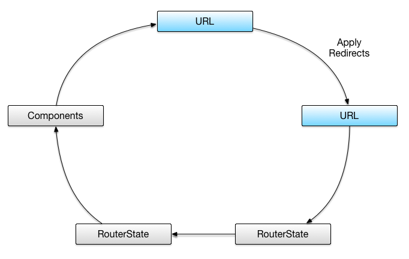
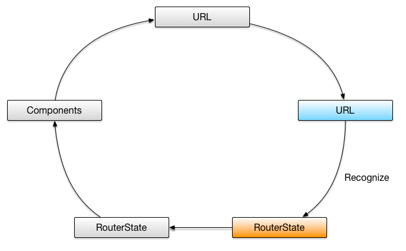
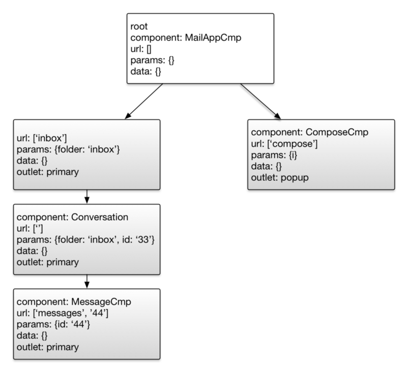
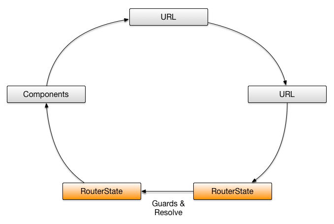
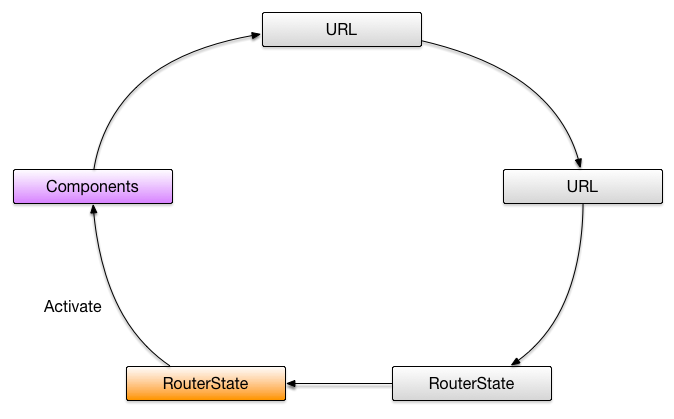
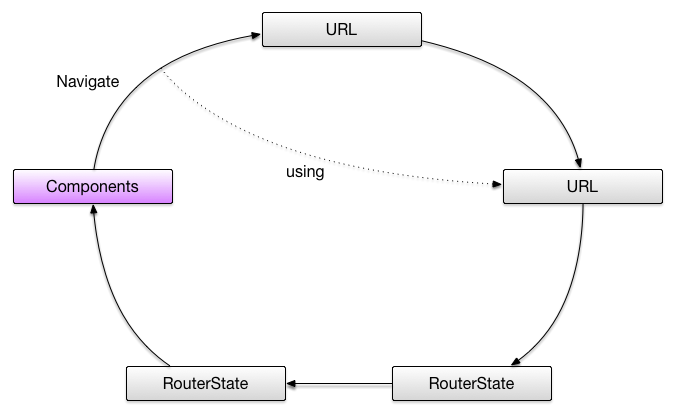
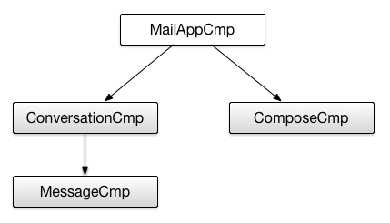

source: https://vsavkin.com/angular-2-router-d9e30599f9ea

translate: web

# Angular 2 Router
管理状态变化是构建 application 最难的部分。尤其是 web 开发时，当你需要确保状态被反映在 URL 中。
另外我们还需要把 application 拆分为多个小部分，并按需加载，做这样的事情显然是繁琐的。

Angular 2 router 解决了这些问题，通过使用路由，你可以用声明的方式指定应用的不同状态，
处理 URL 的同时管理状态的变化，并且按需加载子模块。

> 本文基于 Angular 2 Router 一书,你可以在这里找到它 https://leanpub.com/router.
这本书是一个如何开始的指南，并且深层次地探讨了 router.书中涉及到理论模型，设计约束，以及API相关的主题。
如果你喜欢这篇文章，来看看这本书！

下面的图展示了 Angular router 的五个核心操作。


Angular router 收到一个 URL, 然后:
1. 使用重定向
2. 识别 router 的状态
3. 运行 guards 和 解析数据,
4. 激活需要的组件
5. 管理浏览

## URL 格式
下面我会使用大量的 URL 例子, 我们先看看 URL 的格式。
```
/inbox/33(popup:compose)
/inbox/33;open=true/messages/44
```
如你所见，router 使用圆括号序列化第二个分段(如, popup:compose)，分号语法指定了 outlet，
';parameter=value'指定了路由的参数(例如，open=true)。

<p align="center">...</p>

下面的例子中，我们假设已经按照如下配置了 router，并且我们要浏览 ‘/inbox/33/messages/44’。
```
[
  { path: '', pathMatch: 'full', redirectTo: '/inbox' },
  {
    path: ':folder',
    children: [
      {
        path: '',
        component: ConversationsCmp
      },
      {
        path: ':id',
        component: ConversationCmp,
        children: [
          { path: 'messages', component: MessagesCmp },
          { path: 'messages/:id', component: MessageCmp }
        ]
      }
    ]
  },
  {
    path: 'compose',
    component: ComposeCmp,
    outlet: 'popup'
  },
  {
    path: 'message/:id',
    component: PopupMessageCmp,
    outlet: 'popup'
  }
]
```

## 使用重定向


router 从用户那里得到了 URL，无论是她是点击了链接还是直接更新了位置bar。第一件要做的事情是 router 会使用重定向吗。

什么是重定向

> 重定向是指 URL 分段的替换。它可以是绝对或局部的。
 局部是用不同的分段替换一个分段。决定就是替换整个 URL。
 除非你用斜线作为url前缀，否则重定向是局部的。
 
配置里只有一个重定向规则 { path: '', pathMatch: 'full', redirectTo: '/inbox' },
也就是说用 '/inbox' 替换 '/'。 这个重定向是绝对的，因为 redirectTo 的值是以斜线 '/' 开始的。

我们要浏览 '/inbox/33/messages/44' 而不是 '/'，所以 router 不会进行重定向，URL 保持原样。

## 识别状态


接下来 router 会从 URL 中得出一个 router 状态。为了理解它的机制，我们需要学习一下， router 是如何匹配 URL的。

router 遍历路由的数组，检查 URL 是否以路由的 path 属性的值开始。
在这里它会先检查 'inbox/33/messages/44' 是否以 ':folder' 开始。
如果是，router 会设置参数 folder 为 'inbox'，接着检查 children 配置项，
用剩余的 URL '33/messages/44' 去匹配。结果参数 id 被设为 33，
最后路由 'messages/:id' 被匹配，第二个参数 id 被设为 44。

如果 path 并不匹配 URL，router 会后退一步，选择下一个 path。如果找不到匹配项，浏览就失败了。
如果找到了， 代表 app 将来状态的  router state 被构造。 



一个 router state 包含了激活的路由项。每个激活路由项关联了一个组件(component)。
另外总会有一个激活的路由项关联到 root 组件(一般是 class AppComponent)。

## 运行 Guards


这个阶段我们有了一个未来 router state。接下来 router 会检查转换到这个新状态是否是允许的。
这个过程由运行 guards 来解决。我们会在另一篇文章里讲解 guard，现在我们仅仅需要知道 guards 是由 
router 运行的函数，用来检查浏览指定的 URL 是否是允许的。

## 解析数据
router 运行完 guards 后会解析数据。为了看看它如何工作，我们调整一下上面的配置。
```
[
  {
    path: ':folder',
    children: [
      {
        path: '',
        component: ConversationsCmp,
        resolve: {
          conversations: ConversationsResolver
        }
      }
    ]
  }
]
```

ConversationsResolver 的定义如下:
```typescript
@Injectable()
class ConversationsResolver implements DataResolver {
  constructor(private repo: ConversationsRepo, private currentUser: User) {}

  resolve(route: ActivatedRouteSnapshot, state: RouteStateSnapshot):
      Promise<Conversation[]> {
    return this.repo.fetchAll(route.params['folder'], this.currentUser);
  }
}
```
最后，当 bootstrapping application 时，我们需要注册 ConversationsResolver。
```typescript
@NgModule({
  //...
  providers: [ConversationsResolver],
  bootstrap: [MailAppCmp]
})
class MailModule {
}

platformBrowserDynamic().bootstrapModule(MailModule);
```

现在当浏览 '/inbox'时，router 会创建一个 router state，并且带有一个关联到 conversations 组件的激活的路由。
这个路由会把参数 folder 设为 'inbox'。通过使用这个参数的用户，我们可以获取到用户所有的 inbox conversations。

通过把 route 对象注入到 conversations 组件，我们可以访问解析后的数据。
```typescript
@Component({
  template: `
    <conversation *ngFor="let c of conversations | async"></conversation>
  `
})
class ConversationsCmp {
  conversations: Observable<Conversation[]>;
  constructor(route: ActivatedRoute) {
    this.conversations = route.data.pluck('conversations');
  }
}
```

## 激活需要的组件


目前，我们有了一个 router state。通过需要安装组件 router 可以激活这个 state，并把组件放到合适的 router outlets。

为了理解如何工作，来看看我们如何在组件模板中使用 router outlets。

app root 组件有两个 outlets: primary 和 popup.
```typescript
@Component({
  template: `
    ...
    <router-outlet></router-outlet>
    ...
    <router-outlet name="popup"></router-outlet>
  `
})
class MailAppCmp { }
```
其他组件例如 ConversationCmp 只有一个
```typescript
@Component({
  template: `
    ...
    <router-outlet></router-outlet>
    ...
  `
})
class ConversationCmp { }
```

想象一下当我们浏览 '/inbox/33/messages/44(popup:compose)'.

router 会这么做。首先，实例化 ConversationCmp，把它放入 root 组件的 primary outlet。然后，
实例化一个新的 ComposeCmp 放入 'popup' outlet。最后，
把实例化的 MessageCmp 放入 primary outlet 中的刚创建好的 conversation 组件里。 

## 使用参数
通常组件依赖于 parameters 或 解析的数据。conversation 组件很可能需要访问conversation object.
通过注入 ActivatedRoute，我们可以取得参数和数据。

```typescript
@Component({...})
class ConversationCmp {
  conversation: Observable<Conversation>;
  id: Observable<string>;

  constructor(r: ActivatedRoute) {
    // r.data is an observable
    this.conversation = r.data.map(d => d.conversation);

    // r.params is an observable
    this.id = r.params.map(p => p.id);
  }
}
```

如果我们从 ‘/inbox/33/messages/44(popup:compose)’ 到 ‘/inbox/34/messages/45(popup:compose)’，
data observable 会 emit 一个带有新对象的新 map，并且 conversation 组件会展示 Conversation 34 的信息。

如你所见 router 将参数和数据曝露为 observables，多数情况这很方便，但是有时候我们想要的是一个可以立刻检查的状态快照。
```typescript
@Component({...})
class ConversationCmp {
  constructor(r: ActivatedRoute) {
    const s: ActivatedRouteSnapshot = r.snapshot;
    s.data['conversation']; // Conversation
  }
}
```

## 浏览


此时 router 已经创建了一个 router state 并且安装了组件。
下面我们需要可以从这个 router state 浏览到另一个。有2种方式实现：
* 命令式, 通过调用 'router.navigate' 
* 声明式, 使用 RouterLink 指令

## 命令式浏览
注入 Router service 并调用 navigate
```typescript
@Component({...})
class MessageCmp {
  private id: string;
  constructor(private route: ActivatedRoute, private router: Router) {
    route.params.subscribe(_ => this.id = _.id);
  }

  openPopup(e) {
    this.router.navigate([{outlets: {popup: ['message', this.id]}}]).then(_ => {
      // navigation is done
    });
  }
}
```

## 声明式
通过使用 RouterLink 指令
```typescript
@Component({
  template: `
    <a [routerLink]="['/', {outlets: {popup: ['message', this.id]}}]">Edit</a>
  `
})
class MessageCmp {
  private id: string;
  constructor(private route: ActivatedRoute) {
    route.params.subscribe(_ => this.id = _.id);
  }
}
```
指令添加到 a 标签后，会更新 href 属性的值，所以它是 SEO 友好的，并且右键在新标签中打开也是和我们希望的一样。

## 总结
我们再看一次所有 Angular router 操作


当浏览器加载 '/inbox/33/messages/44(popup:compose)'， router 先进行重定向。在这个例子里没有重定向，
URL 不变。接着 router 使用 URL 构造一个新的 router state.


然后 router 会实例化 conversation 和 message 组件.



现在 message 组件的模板里有下面的链接:
```
<a [routerLink]=”
  ['/', {outlets: {popup: [‘message’, this.id]}}]”>Edit</a>
```

routerLink 指令接收数组并设置 href 属性为 '/inbox/33/messages/44(popup:message/44)'.
 
如果用户点击了这个链接。router 会根据这个构造的 URL 重复整个过程：它会发现 conversation 和 message 组件已经就位。
所以无需再做任何事情。但它会创建一个 PopupMessageCmp 组件的实例，然后把它放入 popup outlet，一旦完成，
router 会更新新的 URL 的 location 属性。
 
信息量很大！但是我们学到了一些知识。Angular router 的核心操作：
重定向，状态识别，运行 guards和解析数据，组件激活，浏览。最后，我们通过 e2e 例子，展示了一个 router 的行为。

