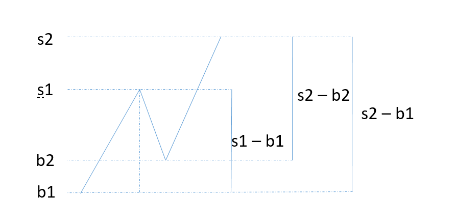

# 121
一个数组每个元素代表每天股票的价格, 求最大利润

显然要低买高卖, 数组中任意一个元素, 和它左边的最小值元素的差, 是这一天卖出的最大利润

我们可以从左遍历, 找出每一天卖出的最大利润, 取最大值 
```java
class Solution {
    public int maxProfit(int[] prices) {
        if (prices.length == 0) return 0;
        int buy = prices[0], profit = 0; 
        for(int i=1;i<prices.length; i++) {
            for(int j=0;j<i; j++)
                buy = Math.min(buy, prices[j]);
            if(prices[i] - buy > profit)
                profit = prices[i] - buy;
        }
        return profit;
    }
}
```
可以看到, 最小值重复计算了n - 1次,  假设我们在j 天买入, 到 k天获得最大利润 P,
那么 j 到 k 天之间的最小值和最大值肯定是 A[j] 和A [k], 且 A[k] - A[j] = P,
如果要出现更大的利润, 那么在x天(x>k), 要么是 A[k'] > A[k], 即 A[k'] - A[j] > P,
要么是 A[k'] - A[j'] > P, (k < j' <k' < n).

```java
class Solution {
    public int maxProfit(int[] prices) {
        if (prices.length == 0) return 0;
        int buy = prices[0], profit = 0;
        for(int i=1;i<prices.length; i++) {
            if(prices[i] - buy > profit) {
                profit = prices[i] - buy;
            } else if(prices[i] < buy) {
                buy = prices[i];    
            }
        }
        return profit;
    }
}
```

# 122 
可以多次买卖, 但是买之前需要卖掉. 返回总利润大小




可以看出, 2次操作的高度和(s1- b1 + s2 -b2)大于一次操作(s2-b1),
所以策略是比之前低价就买入, 最高点卖出,


```java
class Solution {
    public int maxProfit(int[] prices) {
        if(prices.length == 0) return 0;
        int buy = prices[0], profit = 0;
        for(int i=1;i<prices.length; i++) {
            if(prices[i] < prices[i -1]) {
                profit += prices[i -1] - buy;
                buy = prices[i];
            }
        }
        profit += prices[prices.length - 1] - buy;
        return profit;
    }
}
```
# 309
在之前122 的基础上 加了 cooldown, 卖之后的一天不能买.  不是总利润,是每次买卖里的最大利润


