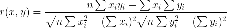

离散与连续
----
离散`discrete` 不连续的数据集

分类与回归
----
回归`regression`

相关性
----
相关系数(Correlation coefficient)

r的范围是[-1,1],大于0是正相关，小于0是负相关

当`|r|=1`时，称`X`,`Y`完全相关，`X`,`Y`之间具有线性函数关系

`|r|>0.8`时，称`X`,`Y`高度相关

当`r=0`时，表示两变量间无线性相关关系。