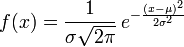
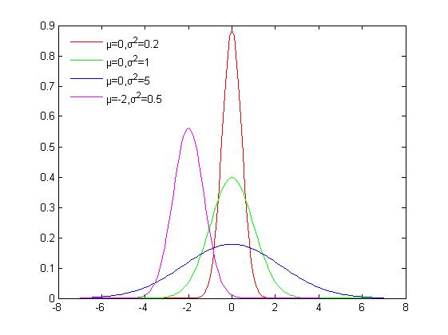
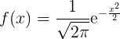
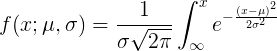
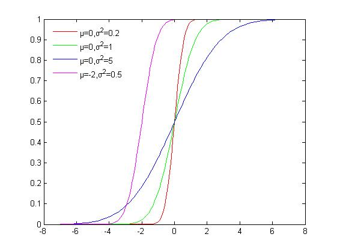

正态分布（Normal distribution）又名高斯分布（Gaussian distribution），
是一个在数学、物理及工程等领域都非常重要的概率分布，在统计学的许多方面有着重大的影响力。

定义
---
若随机变量X服从一个数学期望为μ、标准方差为σ2的高斯分布，记为：X∼N(μ,σ^2),

则其概率密度函数为



μ,σ取值的不同，函数曲线也不同，正态分布的期望值μ决定了其位置，其标准差σ决定了分布的幅度。



我们通常所说的标准正态分布是μ = 0,σ = 1的正态分布（见右图中绿色曲线）。



累积分布函数
------

累积分布函数cumulative distribution function，简称CDF，定义：
对连续函数f(x)，所有小于等于a的值，其出现概率的和。F(a)=P(x<=a)

正态分布的累积分布函数表示为


```
f(x;\mu ,\sigma )=\frac{1}{\sigma \sqrt{2\pi }}\int_{\infty}^{x }e^{-\frac{(x-\mu )^2}{2\sigma ^2}}
```




随机数分布
-----
inverse transform sampling
