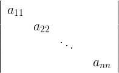
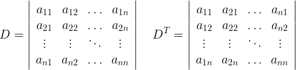
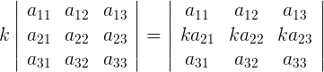
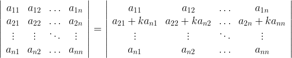

determinant
----
方程组


通过消元可得


我们把分母用一种特殊的方式记录下来


那么这种简写方式就叫做行列式

很显然


这种两行两列的行列式叫做`2阶行列式`

我们来观察一个3阶行列式


可以发现一个三阶行列式可以用多个二阶行列式表示


而每个二阶行列式的系数和行列式自身也有关系


而系数的符号跟系数在行列式的位置有关


如果系数和子行列式我们用大写`A`表示,如


那么整个表表达式可以写作


当然也可以选取第二行的数当作系数


所以一个n阶行列式`D`, 可以这么分解


其中`Aij`叫做元素`aij`的`代数余子式`


特殊行列式
-----
只有对角线上有元素，其他位置都为0的行列式，称为`对角行列式`



值就是所有元素的乘积

行列式转置
-----
行变列，列变行



在python中转置
```python
array = [[3, 6, 4], [2, 4, 8], [1, 6, 9]]
print map(list, zip(*array))
>>> [[3, 2, 1], [6, 4, 6], [4, 8, 9]]
```

行列式转置后，值不变，也就是D=DT

很好证明，D按第一行展开代数余子式，DT按第一列展开，两个多项式相同

几个重要性质
------
如果其中两行，或者两列交换了位置，值乘以-1
```
|a1 a2 a3|
|b1 b2 b3| = a1|b2 b3| - a2|b1 b3| + a3|b1 b2|
|c1 c2 c3|     |c2 c3|     |c1 c3|     |c1 c2|

1 2 行交换位置
|b1 b2 b3|
|a1 a2 a3| = -a1|b2 b3| + a2|b1 b3| - a3|b1 b2|
|c1 c2 c3|      |c2 c3|     |c1 c3|     |c1 c2|
```
可以看到，交换行后每次都按`|a1 a2 a3|`展开，只有系数变化了

进一步可以推论，两行(两列)完全相同，那么交换这两行,行列式写法不变，那么行列式的值肯定为0


行列式乘以一个数，等于一行(列)上每个元素都乘以这个数



某一行(列)元素加上另一行(列)元素的k倍，行列式值不变



Python中如何计算行列式
----
```python
import numpy as np

A = np.array([
    [3, 6, 4],
    [2, 4, 8],
    [1, 6, 9]
])

print np.linalg.det(A)
>>> -64
```