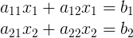

determinant
----
方程组



通过消元可得


我们把分母用一种特殊的方式记录下来


那么这种简写方式就叫做行列式

很显然


这种两行两列的行列式叫做`2阶行列式`

我们来观察一个3阶行列式


可以发现一个三阶行列式可以用多个二阶行列式表示


而每个二阶行列式的系数和行列式自身也有关系


而系数的符号跟系数在行列式的位置有关


如果系数和子行列式我们用大写`A`表示,如


那么整个表表达式可以写作


当然也可以选取第二行的数当作系数


所以一个n阶行列式`D`, 可以这么分解


其中`Aij`叫做元素`aij`的`代数余子式`


Python中如何计算行列式
----
```python
import numpy as np

A = np.array([
    [3, 6, 4],
    [2, 4, 8],
    [1, 6, 9]
])

print np.linalg.det(A)
>>> -64
```