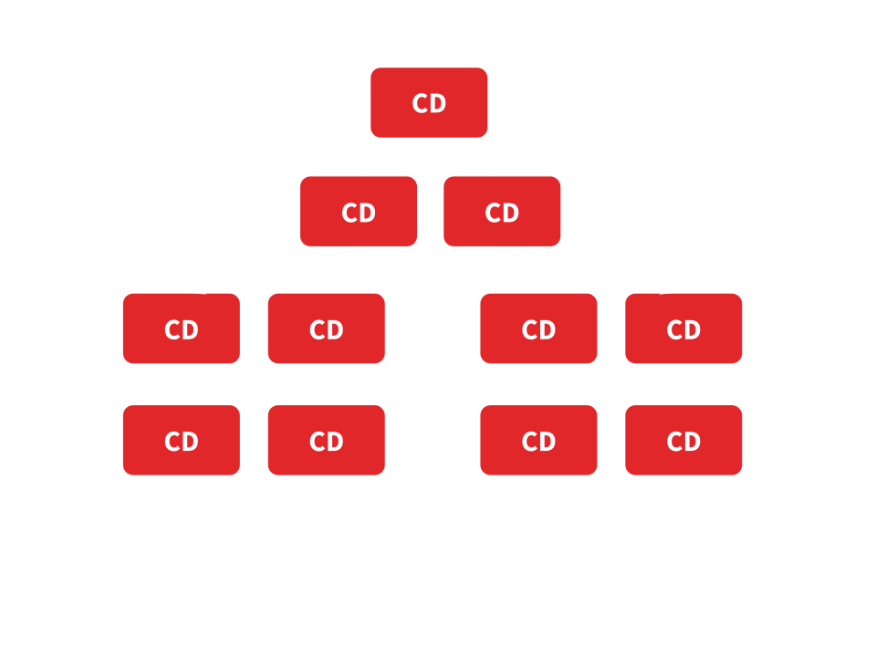
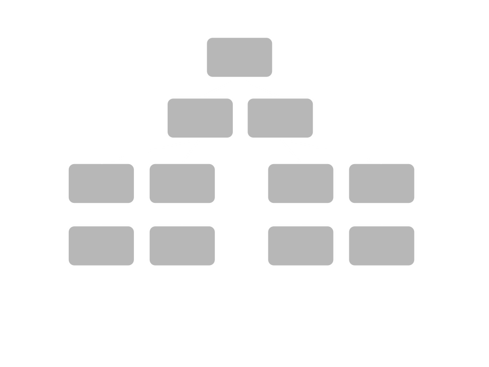
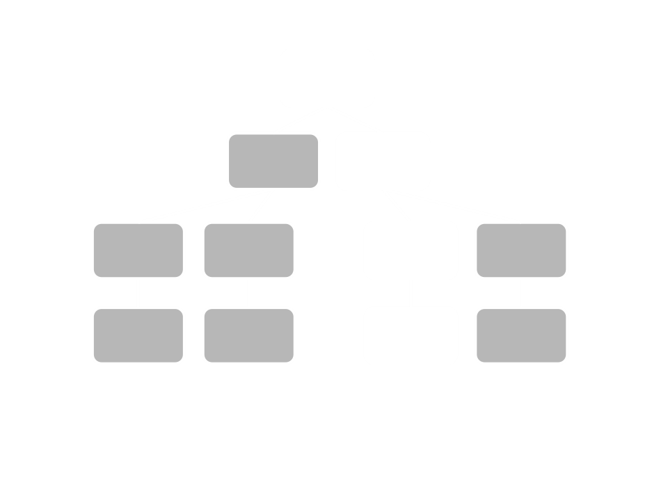
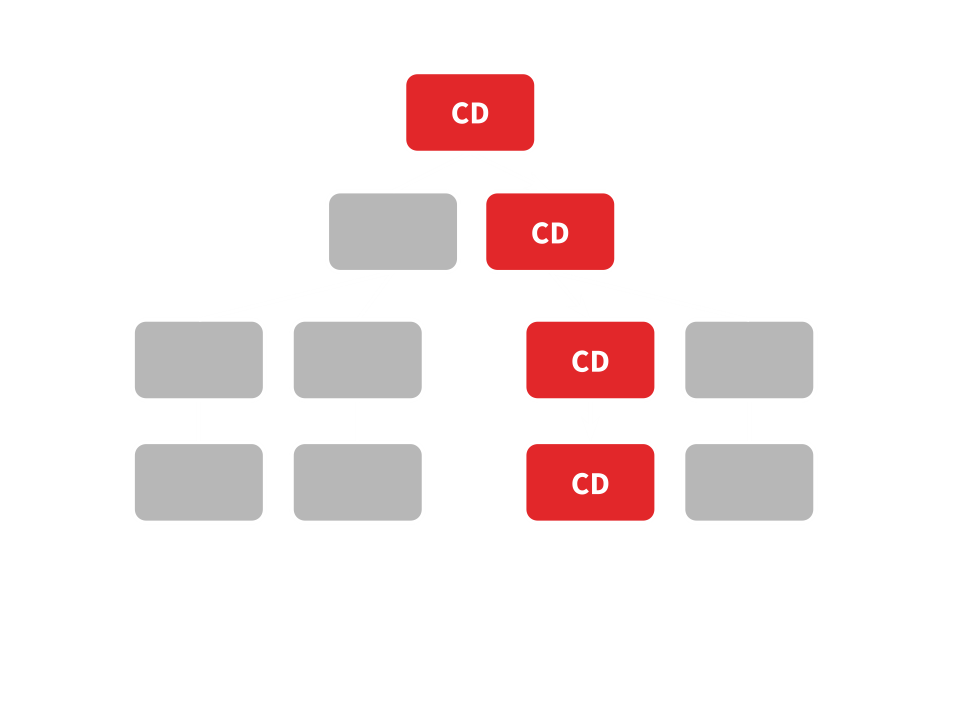

http://blog.thoughtram.io/angular/2016/02/22/angular-2-change-detection-explained.html

# What’s Change Detection anyways?
数据在浏览器上以图片，表单，连接，按键等形式展示，这就是 Document Object Model (DOM)。
所以基本上我们接收数据输入然后生成 DOM 展示给用户。这个过程叫做渲染 rendering。

runtime 情况下，渲染时发生一个变化会很诡异，例如当 DOM 渲染后，数据变了，如何重新渲染。
一种方式是刷新浏览器，另一种是对比 DOM 前后的差异变化，仅仅渲染差异的部分，这正是 ReactJS 通过 Virtual DOM  做的事情。
 
下面我们看一下 Angular 2 的 Change Detection

# What causes change?
基本上导致变化有以下几种情况
* Events - click, submit, …
* XHR - Fetching data from a remote server
* Timers - setTimeout(), setInterval()

都是异步，当发生异步操作后，我们 app 的状态会改变，这就需要有人告诉 Angular 去更新视图。

# Who notifies Angular?
Angular 允许我们直接使用原生 API，并没有拦截方法让我们告诉angular去更新 DOM。

如果你看过我的其他文章，你就知道是 [Zones](https://github.com/liuyangc3/note-book/blob/master/Angular2/Zone.md) 负责这些工作。
Angular 用自己的 `NgZone`。

简短来说，Angular 2 代码里有一个 `ApplicationRef`，用来侦听 `NgZones` 的 `onTurnDone`的事件,
当事件发生时，它会调用 tick() 函数，本质上是 tick 执行 change detection。
```typescirpt
// very simplified version of actual source
class ApplicationRef {

  changeDetectorRefs:ChangeDetectorRef[] = [];

  constructor(private zone: NgZone) {
    this.zone.onTurnDone
      .subscribe(() => this.zone.run(() => this.tick());
  }

  tick() {
    this.changeDetectorRefs
      .forEach((ref) => ref.detectChanges());
  }
}
```

# Change Detection
当 change detection 触发后是如何工作的，首先我们要知道，每个 component 有自己的 change detector.

这允许我们单独控制每个 component，

假设 component tree 中某处发生了一个事件，也许一个button被点击了，下来会发生什么。
因为每个 component 有自己的 change detector，而 component 是树形，所以逻辑上也会有个
change detector 树，如图，数据总是从上到下流动。


从上至下的原因是，change detection 总是由从上至下的单个 component 执行，每一次都是从 root component 开始。
这种单向的数据流动比周期检测要好，因为仅仅影响使用的组件，我们可以知道数据来自于哪个我们使用的视图。

# Performance
Angular 在运行时为每个 Angular 创建 change detector classes ，

# Smarter Change Detection
每次事件发生，Angular 检测每个组件，但也许 app 的 状态并没有变，我们是否可以告诉 Angular，
仅仅更新 app 变化的那一部分呢？

是的，数据结构 Immutables and Observables 可以保证一些东西是否改变了，如果我们使用这些类型告诉angular，
change detection 会很快。

## Understanding Mutability
为了了解不可变数据，我们先看看可变数据，假设我们有如下组件
```tpyescript
@Component({
  template: '<v-card [vData]="vData"></v-card>'
})
class VCardApp {

  constructor() {
    this.vData = {
      name: 'Christoph Burgdorf',
      email: 'christoph@thoughtram.io'
    }
  }

  changeData() {
    this.vData.name = 'Pascal Precht';
  }
}
```
VCardApp 使用 <v-card> 做为 子component，子component有个 input 属性 vData，我们通过 VCardApp 自己的 vData 属性，
传递数据到子组件。vData 是个对象，有2个属性，有一个方法 changeData() 用来改变 vData 对象的 name 属性。

重要的是，changeData() 通过改变 name 属性 改变了vData，但 vData 自己的引用保持一致。

假设某事件导致 changeData() 执行，change detection 执行时会发生什么？首先  vData.name 变化了，然后被传递到
<v-card>， <v-card> 的 change detector 会检测传入的 vData 是否还是之前的那个，当然是了，所以引用没有变。
但是 name 属性变了，尽管如此，angular 还是对这个对象执行 change detection.

因为  objects 在 JavaScript 是可改变的， angular 必须要保守些，当事件发生时，要对每个组件进行 change detection。

这就是为什么要使用不可变对象了。

# Immutable Objects
不可变对象保证了对象是不能被改变的，如果我们想在不可变对象上做点改变，改动后会得到一个新的对象引用，原始对象没有变。
简短来说：一旦有改变，我们得到新引用。

# Reducing the number of checks
当输入属性没有变化，Angular 会忽略整个子树的 change detection，我们刚学到 "变化" 是 "新引用"。如果在app里使用不可变对象，
如果组件 input 没有改变，我们需要告诉 angular 去忽略 change detection。

我们来看看 <v-card>
```typescript
@Component({
  template: `
    <h2>{{vData.name}}</h2>
    <span>{{vData.email}}</span>
  `
})
class VCardCmp {
  @Input() vData;
}
```
VCardCmp 仅仅依赖 input 属性，如果 input 没有改变，我们可以通过设置 change detection 为 OnPush，来告诉
Angular 忽略 这个组件子树的 change detection。
```typescript
@Component({
  template: `
    <h2>{{vData.name}}</h2>
    <span>{{vData.email}}</span>
  `,
  changeDetection: ChangeDetectionStrategy.OnPush
})
class VCardCmp {
  @Input() vData;
}
```

Angular 2 and Immutable.js 实现的[扫雷](http://www.jvandemo.com/how-i-optimized-minesweeper-using-angular-2-and-immutable-js-to-make-it-insanely-fast/)

# Observables
之前提过，Observables 也有保证机制，但是对象的引用不会变。这样的情况下， Angular 有聪明的方式来允许路径上的组件被检测。
 
为了了解这个机制，我们先看看下面的组件
```typescript
@Component({
  template: '{{counter}}',
  changeDetection: ChangeDetectionStrategy.OnPush
})
class CartBadgeCmp {

  @Input() addItemStream:Observable<any>;
  counter = 0;

  ngOnInit() {
    this.addItemStream.subscribe(() => {
      this.counter++; // application state changed
    })
  }
}
```
这是个购物车，

设置了 OnPush， change detection 不是总执行，只有组件 input 变化时才发生。 

然而 addItemStream 的引用永不会变，所以 change detection 在子树永不执行，即便设置了OnPush all，
change detection 也不会执行。 现在是这样的




如何通知 Angular ？ Angular 总是会从上到下执行  change detection，所以我们只需要知道，变化发生的组件在整个路径的位置。

我们可以通过 DI 访问 component 的 ChangeDetectorRef ，它有个API 叫 markForCheck()，这个方法就是我们需要的。
直到下轮 change detection 执行时，root 被检查前，它会一直标记我们的 component 的路径。
```typescript
@Component({
  template: '{{counter}}',
  changeDetection: ChangeDetectionStrategy.OnPush
})
class CartBadgeCmp {

  @Input() addItemStream:Observable<any>;
  counter = 0;

  constructor(private cd: ChangeDetectorRef) {}  // Let’s inject it into our component:
  ngOnInit() {
    this.addItemStream.subscribe(() => {
      this.counter++; // application state changed
      // Then, tell Angular to mark the path from this component until root to be checked:
      this.cd.markForCheck(); // marks path
    })
  }
}
```

boom, 当observable 事件发生前，change detection 是这样的 



change detection 执行时，会从上至下



一旦 change detection 结束， 它会为整个树 恢复 OnPush 的状态。
 
 