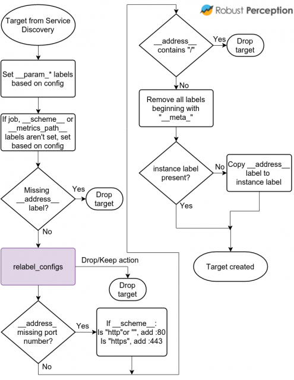
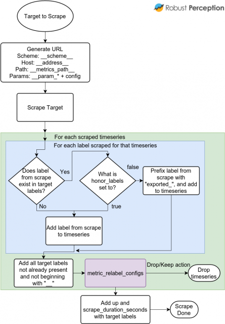

https://www.robustperception.io/life-of-a-label/

label 原理是

服务发现提供了诸如机器类型,tags,region等元数据保存在 `__meta_*` 开头的 label，
这些标签通过targets 的relabel_config realbel 到新的 label。

你可以通过 `drop`和`keep` actions 过滤 targets

当真正开始 scrape target时，通过 `metric_relabel_configs` 可允许你 tweak 从scrape 返回的时间序列，
Filtering  也可以用作成[处理昂贵开销的metric的](https://www.robustperception.io/dropping-metrics-at-scrape-time-with-prometheus/) 的模板

这些组件如何一起工作，Prometheus 0.17.0的流程图，它包含了target如何创建，scraped，在时间序列插入数据库前提供哪些操作特性，

此时，Prometheus 已经知道了需要 scrape 的 taraget，他们就是 status 页面看到的信息，这里的核心是紫色框内relabeling，
其他的都是默认的，理智的检查让你的生活更轻松。

当一个 target 真正被 scrape 时， 这是发生的事情

`__param_*` labels 包含了每个 URL 参数的第一个值, 允许你relabel 第一个值。
在 scrape 时，他们会和第二个和随后的参数值组合一起。

`metric_relabel_configs` 是应用于每个scraped时间序列的，所以最好改善你的基础设施，而不是在Prometheus这边使用 `metric_relabel_configs` 
作为解决方案。
