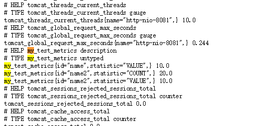

# actuator


## info
添加 git 信息, 插件
```
plugins {
  id "com.gorylenko.gradle-git-properties" version "1.5.1"
}
```
添加 build 信息 build.gradle
```
springBoot {
  buildInfo()
}
```

返回结果
```js
// /actuator/info

{
  "git": {
    "commit": {
    "time": "2019-01-11T10:22+0800",
    "id": "10cead8"
  },
    "branch": "origin/test"
  },
  "build": {
    "version": "1.0-SNAPSHOT",
    "artifact": "crm-webapp",
    "name": "crm-webapp",
    "group": "com.nxin",
    "time": "2019-01-11T02:23:20.704Z"
  }
}
```

展示git全部信息
```
management.info.git.mode=full
```

## httptrace
默认会记录最近的 100 次请求
```js
{
	"traces": [
		{
			"timestamp": "2019-01-11T06:19:38.805Z",
			"principal": null,
			"session": null,
			"request": {
				"method": "GET",
				"uri": "http://nxincrm.t.nxin.com/actuator/info",
				"headers": {
					"Cookie": ["JSESSIONID=q4bzAHRHCmmOIqWKCPrczoMP01fqdKKnjmUy2F1q"],
					"Accept": [
						"text/html,application/xhtml+xml,application/xml;q=0.9,image/webp,image/apng,*/*;q=0.8"
					],
					"User-Agent": [
						"Mozilla/5.0 (Windows NT 10.0; Win64; x64) AppleWebKit/537.36 (KHTML, like Gecko) Chrome/71.0.3578.98 Safari/537.36"
					],
					"X-Forwarded-For": ["10.100.27.29"],
					"Host": ["nxincrm.t.nxin.com"],
					...
				},
			},
		"response": {
			"status": 200,

		},
		"timeTaken": 18
	},
	
	//  request 2...
	]
}
```

## health
监控状态检查
```js
// /actuator/health

{
	"status": "UP",
	"details": {
		"diskSpace": {
		"status": "UP",
		"details": {
			"total": 105551921152,
			"free": 95758790656,
			"threshold": 10485760
		}
	},
...
```

## metrics
看连接池信息

```js
// /actuator/metrics/hikaricp.connections.pending

{
  "name": "hikaricp.connections.pending",
  "description": "Pending threads",
  "baseUnit": null,
  "measurements": [
    {
      "statistic": "VALUE",
      "value": 0
    }
  ],
  "availableTags": [{
    "tag": "pool",
    "values": [
      "HikariPool-1",
      "HikariPool-2"
    ]
  }]
}
```

看请响应值200的求次数和时间

```js
// /actuator/metrics/http.server.requests?tag=uri:/user/getUserResources&tag=status:200

{
  "name": "http.server.requests",
  "description": null,
  "baseUnit": "seconds",
  "measurements": [
  {
    "statistic": "COUNT",
    "value": 1
  },
  {
    "statistic": "TOTAL_TIME",
    "value": 0.937897519
  },
  {
    "statistic": "MAX",
    "value": 0
  }
  ],
  ...
```

## prometheus

添加依赖
```
compile group: 'io.micrometer', name: 'micrometer-registry-prometheus', version: '1.1.1'
```
请求地址
```
curl http://localhost:8080/actuator/prometheus
```
返回内容
```
# HELP hikaricp_connections_active Active connections
# TYPE hikaricp_connections_active gauge
hikaricp_connections_active{pool="HikariPool-1",} 0.0
# HELP jvm_buffer_total_capacity_bytes An estimate of the total capacity of the buffers in this pool
# TYPE jvm_buffer_total_capacity_bytes gauge
jvm_buffer_total_capacity_bytes{id="direct",} 114815.0
jvm_buffer_total_capacity_bytes{id="mapped",} 0.0
# HELP jvm_threads_peak_threads The peak live thread count since the Java virtual machine started or peak was reset
# TYPE jvm_threads_peak_threads gauge
jvm_threads_peak_threads 53.0
# HELP jvm_buffer_count_buffers An estimate of the number of buffers in the pool
# TYPE jvm_buffer_count_buffers gauge
jvm_buffer_count_buffers{id="direct",} 13.0
jvm_buffer_count_buffers{id="mapped",} 0.0
# HELP rabbitmq_consumed_total  
# TYPE rabbitmq_consumed_total counter
rabbitmq_consumed_total{name="rabbit",} 0.0
# HELP hikaricp_connections Total connections
# TYPE hikaricp_connections gauge
hikaricp_connections{pool="HikariPool-1",} 10.0
# HELP process_files_open_files The open file descriptor count
# TYPE process_files_open_files gauge
process_files_open_files 135.0
...
```

prometheus 配置上app 的地址后, 就能收集到数据了


配置 prometheus scrape 收集信息


## custom endpoint
当默认的 endpoint 不满足需求, 如何自己实现

自定义 info, 实现 ` InfoContributor` 即可
```java
import java.util.Collections;

import org.springframework.boot.actuate.info.Info;
import org.springframework.boot.actuate.info.InfoContributor;
import org.springframework.stereotype.Component;

@Component
public class ExampleInfoContributor implements InfoContributor {

    @Override
    public void contribute(Info.Builder builder) {
        builder.withDetail("example",
        Collections.singletonMap("key", "value"));
    }
}
```

自定义 metrics, 把 `MeterRegistry` 注入到组件里

```java
@Configuration
@EnableConfigurationProperties(MetricsProperties.class)
public class MetricsConfiguration {

  @Bean
	public MyTestMetrics myTestMetrics() {
		return new MyTestMetrics();
	}
}
```
 
```java
import io.micrometer.core.instrument.Measurement;
import io.micrometer.core.instrument.Meter;
import io.micrometer.core.instrument.MeterRegistry;
import io.micrometer.core.instrument.Statistic;
import io.micrometer.core.instrument.Tag;
import io.micrometer.core.instrument.Tags;
import io.micrometer.core.instrument.Meter.Type;
import io.micrometer.core.instrument.binder.MeterBinder;

import static java.util.Collections.emptyList;

import java.util.ArrayList;
import java.util.List;

public class MyTestMetrics implements MeterBinder {

	private final Iterable<Tag> tags;

	public MyTestMetrics() {
		this(emptyList());
	}

	public MyTestMetrics(Iterable<Tag> tags) {
		this.tags = tags;
	}

	@Override
	public void bindTo(MeterRegistry registry) {
		Iterable<Tag> tagsWithId = Tags.concat(tags, "id", "name");
		List<Measurement> measurementList = new ArrayList<>();
		Measurement measurement = new Measurement(() ->{return 10D;}, Statistic.VALUE); 
		measurementList.add(measurement);	
		Meter.builder("my.test.metrics", Type.OTHER, measurementList)
			.tags(tagsWithId)
			.description("description")
			.register(registry);

		Iterable<Tag> tagsWithId2 = Tags.concat(tags, "id", "name2");
		List<Measurement> measurementList2 = new ArrayList<>();
		Measurement measurement3 = new Measurement(() ->{return 10D;}, Statistic.VALUE); 
		Measurement measurement2 = new Measurement(() ->{return 20D;}, Statistic.COUNT); 
		measurementList2.add(measurement2);
		measurementList2.add(measurement3);
		Meter.builder("my.test.metrics", Type.OTHER, measurementList2)
			.tags(tagsWithId2)
			.description("description2")
			.register(registry);
	}
}
```
自动曝露到 Prometheus



# actuator admin
actuator 有个一个管理界面, 默认使用 euraka 作为服务发现, 但是并不是所有项目都使用了 `euraka`

通过内部 project 项目实现了一个 DiscoveryClient
https://gitlab.nxin.com/wenqx/actuator-admin/blob/master/src/main/java/com/nxin/actuator/core/ProjDiscoveryClient.java

# nginx
deny 外部方式这个 uri
```
location /actuator {
  deny all;
}
```

# 其他
```
management.health.ldap.enabled = false
management.endpoint.shutdown.enabled=false
```

