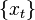
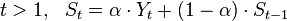

CPU负载可以通过 /proc/loadavg 查看

```
cat /proc/loadavg
0.00 0.00 0.00 1/139 9244
```

man 手册里提到，前3列分别是1分钟，5分钟和15分钟时，统计的系统负载，后面2列是什么意思，我们来看下代码：

```c
// fs/proc/loadavg.c 2.6.32

#define LOAD_INT(x) ((x) >> FSHIFT)
#define LOAD_FRAC(x) LOAD_INT(((x) & (FIXED_1-1)) * 100)

static int loadavg_proc_show(struct seq_file *m, void *v)
{
	unsigned long avnrun[3];

	get_avenrun(avnrun, FIXED_1/200, 0);

	seq_printf(m, "%lu.%02lu %lu.%02lu %lu.%02lu %ld/%d %d\n",
		LOAD_INT(avnrun[0]), LOAD_FRAC(avnrun[0]),
		LOAD_INT(avnrun[1]), LOAD_FRAC(avnrun[1]),
		LOAD_INT(avnrun[2]), LOAD_FRAC(avnrun[2]),
		nr_running(), nr_threads,
		task_active_pid_ns(current)->last_pid);
	return 0;
}
```
可以看到前3列的数据是通过2个宏 `LOAD_INT` 和 `LOAD_FRAC` 计算出来的

第四列 1/139 是 `nr_running()/nr_threads`，一个表示正在运行的task数量，另一个表示总task数量。这里统计的包括所有cpu

第五列 9244 是 `task_active_pid_ns(current)->last_pid`， 表示当前活动进程的最后一个task的pid

我们可以验证一下这个last_pid，写个脚本 t.sh
```
sleep 1000
```
然后运行 sh t.sh &,用过ps得到该进程的pid是9272
```
root      9272  9271  0 11:39 pts/0    00:00:00 sleep 1000
root      9277  9229  0 11:41 pts/0    00:00:00 ps -ef
```
然后运行 cat /proc/loadavg
```
[root@web ~]# cat /proc/loadavg
0.00 0.00 0.00 1/141 9278
[root@web ~]# cat /proc/loadavg
0.00 0.00 0.00 1/141 9279
[root@web ~]# cat /proc/loadavg
0.00 0.00 0.00 1/141 9280
```
可以看到 pid 不断增加， 因为cat 命令也是进程，所以cat 时会产生一个进程，last_pid会加1

下面来看看 LOAD_INT 和 LOAD_FRAC
```
#define LOAD_INT(x) ((x) >> FSHIFT)
#define LOAD_FRAC(x) LOAD_INT(((x) & (FIXED_1-1)) * 100)
```

这里面出现了 FIXED_1 和 FSHITF，这些个宏的定义在
```c
// linux/sched.h 2.6.32

/*
 * These are the constant used to fake the fixed-point load-average
 * counting. Some notes:
 *  - 11 bit fractions expand to 22 bits by the multiplies: this gives
 *    a load-average precision of 10 bits integer + 11 bits fractional
 *  - if you want to count load-averages more often, you need more
 *    precision, or rounding will get you. With 2-second counting freq,
 *    the EXP_n values would be 1981, 2034 and 2043 if still using only
 *    11 bit fractions.
 */
extern unsigned long avenrun[];		/* Load averages */
extern void get_avenrun(unsigned long *loads, unsigned long offset, int shift);

#define FSHIFT		11		/* nr of bits of precision */
#define FIXED_1		(1<<FSHIFT)	/* 1.0 as fixed-point */
#define LOAD_FREQ	(5*HZ+1)	/* 5 sec intervals */
#define EXP_1		1884		/* 1/exp(5sec/1min) as fixed-point */
#define EXP_5		2014		/* 1/exp(5sec/5min) */
#define EXP_15		2037		/* 1/exp(5sec/15min) */

#define CALC_LOAD(load,exp,n) \
	load *= exp; \
	load += n*(FIXED_1-exp); \
	load >>= FSHIFT;
```
首先注释里就说明了，设置了一些常量，进行 fixed point 运算来表示负载的统计值。 

Fixed Point Number Representation
------
其核心思想是用2进制来表示小数，例如一个小数26.5

2^5 | 2^4 | 2^3 | 2^2 | 2^1 | 2^0 | Binary Point | 2 ^-1 
--- | --- | --- | --- | --- | --- | ------------ | --- 
... |  1  |  1  |  0  |  1  |  0  |   __.__      | 1 

= 1 * 2^4 + 1 * 2^3 + 0 * 2^2 + 1 * 2^1 + 0* 2^0 + 1 * 2^-1

= 16 + 8 + 2 + 0.5

= 26.5


例如值1.23 使用fixed-point数据类型来表示就是 1230 加上一个比例系数(scaling factor) 1/1000。用值乘以比例系数就得到了原先的小数值。

代码这里具体是使用 10.11的结构，就用10 bit来表示整数部分，11 bit 来表示分数部分。  

通过相乘2个 11bit的分数，扩展成为21bit：前10 bit表示负载的整数部分，后11 bit表示小数部分。


LOAD_INT(x) 表示 x右移动11位


因为Linux内核是不允许浮点运算的，所以这个通过trick，可以实现用一个整数来表示小数，
刚才的宏LOAD_INT用来计算负载的整数部分，而LOAD_FRAC计算小数部分。

fixed point  scaling factor比例系数

FSHIFT 就是位数11，FIXED_1就是把1左移11位， 

宏 LOAD_FREQ 是采样计算 load 的间隔时间，为5秒。
紧接着后面定义了3个魔术值 EXP_1,EXP_5,EXP_15 和 一个 宏 CALC_LOAD 
EXP1 5 15 的值是 1884, 2014, 2037 这是什么东西？

解释它们之前要先讲一些数学概念。

通常情况下计算一个集合{X1,X2...Xn}所有元素的平均值s，需要所有元素的和sum(X)和集合元素的个数n
```
s = sum(Xn) / n
```
如果我们要计算CPU load的平均值，我们就需要存储每次采集的Load值。这在以前的硬件条件下是不可能的，
那时候内存仅有几MB，是很稀有的资源。

simple moving average 
----
简单移动平均（SMA）又称 算术移动平均

当我们有一个基于时间的 序列 时，S(t)表示最后 k 个元素的平均值


S(t) = S(t-1) + ( X(t)-X(t-k) ) / k


Exponential moving average
-----
指数移动平均



Yt 表示t时刻的值，St 表示 到t时刻期间的EMA值

Linux 使用EMA来计算负载，宏CALC_LOAD 实际上是计算负载的方式，


根据上面的公式, t 时刻的负载为
```
load(t) = load(t-1) + EXP_R[N(t) - load(t-1)]
```
EXP_R 为平滑因子

如果指数衰减


https://luv.asn.au/overheads/NJG_LUV_2002/luvSlides.html

https://www.teamquest.com/import/pdfs/whitepaper/ldavg1.pdf
https://www.teamquest.com/import/pdfs/whitepaper/ldavg2.pdf

http://www.makelinux.net/books/lkd2/ch04lev1sec2