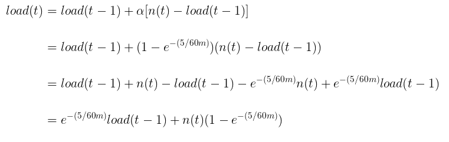

CPU负载可以通过 /proc/loadavg 查看

```
cat /proc/loadavg
0.00 0.00 0.00 1/139 9244
```

man 手册里提到，前3列分别是1分钟，5分钟和15分钟时，统计的系统负载，后面2列是什么意思，我们来看下代码：

```c
// fs/proc/loadavg.c 2.6.32

#define LOAD_INT(x) ((x) >> FSHIFT)
#define LOAD_FRAC(x) LOAD_INT(((x) & (FIXED_1-1)) * 100)

static int loadavg_proc_show(struct seq_file *m, void *v)
{
	unsigned long avnrun[3];

	get_avenrun(avnrun, FIXED_1/200, 0);

	seq_printf(m, "%lu.%02lu %lu.%02lu %lu.%02lu %ld/%d %d\n",
		LOAD_INT(avnrun[0]), LOAD_FRAC(avnrun[0]),
		LOAD_INT(avnrun[1]), LOAD_FRAC(avnrun[1]),
		LOAD_INT(avnrun[2]), LOAD_FRAC(avnrun[2]),
		nr_running(), nr_threads,
		task_active_pid_ns(current)->last_pid);
	return 0;
}
```
可以看到前3列的数据是通过2个宏 `LOAD_INT` 和 `LOAD_FRAC` 从`avnrun`数组计算出来的
```
LOAD_INT(avnrun[0]), LOAD_FRAC(avnrun[0]),
LOAD_INT(avnrun[1]), LOAD_FRAC(avnrun[1]),
LOAD_INT(avnrun[2]), LOAD_FRAC(avnrun[2])
```

第四列是 `nr_running()/nr_threads`，前面的是正在运行的 task 数量，后面的是总 task 数量。这里统计的包括所有cpu

最后一列是 `task_active_pid_ns(current)->last_pid`， 表示当前活动进程的最后一个 task 的 pid

下面来看看 `LOAD_INT` 和 `LOAD_FRAC` ：
```
#define LOAD_INT(x) ((x) >> FSHIFT)
#define LOAD_FRAC(x) LOAD_INT(((x) & (FIXED_1-1)) * 100)
```

这里用到了2个宏 `FIXED_1` 和 `FSHITF`，这些个宏的定义在
```c
// linux/sched.h 2.6.32

/*
 * These are the constant used to fake the fixed-point load-average
 * counting. Some notes:
 *  - 11 bit fractions expand to 22 bits by the multiplies: this gives
 *    a load-average precision of 10 bits integer + 11 bits fractional
 *  - if you want to count load-averages more often, you need more
 *    precision, or rounding will get you. With 2-second counting freq,
 *    the EXP_n values would be 1981, 2034 and 2043 if still using only
 *    11 bit fractions.
 */
extern unsigned long avenrun[];		/* Load averages */
extern void get_avenrun(unsigned long *loads, unsigned long offset, int shift);

#define FSHIFT		11		/* nr of bits of precision */
#define FIXED_1		(1<<FSHIFT)	/* 1.0 as fixed-point */
#define LOAD_FREQ	(5*HZ+1)	/* 5 sec intervals */
#define EXP_1		1884		/* 1/exp(5sec/1min) as fixed-point */
#define EXP_5		2014		/* 1/exp(5sec/5min) */
#define EXP_15		2037		/* 1/exp(5sec/15min) */

#define CALC_LOAD(load,exp,n) \
	load *= exp; \
	load += n*(FIXED_1-exp); \
	load >>= FSHIFT;
```
首先注释里就说明了，设置了一些常量，进行 fixed point 运算来表示负载的统计值。 

那么什么是 fixed point ？

Fixed Point Number Representation
------
其核心思想是用2进制来表示小数，例如一个小数26.5

2^5 | 2^4 | 2^3 | 2^2 | 2^1 | 2^0 | Binary Point | 2 ^-1 
--- | --- | --- | --- | --- | --- | ------------ | --- 
... |  1  |  1  |  0  |  1  |  0  |   __.__      | 1 

我们计算上面的二进制得到
```
= 1 * 2^4 + 1 * 2^3 + 0 * 2^2 + 1 * 2^1 + 0* 2^0 + 1 * 2^-1

= 16 + 8 + 2 + 0.5

= 26.5
```
可以看到定义一个 fixed point 类型只需要2个参数
* 数据长度，用 w 表示
* 小数点的偏移量，用 b 表示

我们用`fixed<w,b>`来表示一个fixed point 类型，例如` fixed<8,3>`表示8 bit的数据，和小数点偏移量3.

假设数据值为 00010.110，通过计算得到其十进制的值为2.75
```
= 1 * 2^1 + 1 * 2^-1 + 1 * 2^-2

= 2 + 0.5 + 0.25

= 2.75
```
或者000.10110表示0.6875
```
= 1 * 2^-1 + 1 * 2^-3 + 1 * 2^-4

= 0.5 + 0.125 + 0.0625

= 0.6875
```

因为Linux内核是不允许浮点运算的，所以通过fixed point ，可以高效地进行浮点运算。
而负载这里具体是使用`fixed<21,11>`的结构，即用 10 bit 来表示整数部分，11 bit 来表示分数部分。  

为什么是10 11这样划分？如果2个小数做乘法，整数的部分可以通过加法来代替，而小数部分相乘会变成 22 bit，这在注释中也有提到
```
- 11 bit fractions expand to 22 bits by the multiplies ...
```
而 10 bit + 22 bit = 32 bit，这样就解释了为什么这么划分。

接着看`FIXED_1`,值 1 << 11 ,它是吧1左移11位，相当于把小数的部分全部置为0，所以在`fixed<21,11>`的结构下，FIXED_1表示的小数应该是`1.0`。

这里我们假设 x 为 1100.1，那么它的 21 bit 完整格式是
```
0000001100.10000000000
```
用整数表示就是25600，其中整数部分`1100`的值是12，小数部分是1024,代表0.5

LOAD_INT(x) 表示 x右移动11位,刚好取出整数部分，25600 >> 11 刚好得到12。

而LOAD_FRAC(x) 比较复杂，公式为 LOAD_INT(((x) & (FIXED_1-1)) * 100)，我们慢慢看：

x 和 FIXED_1 - 1 做与运算，刚好取出最后11位
 
再对 x 和 FIXED_1 - 1 做与运算得到1024
```
        11111111111      (2047)
&  1100.10000000000      (x)
-----------------------
        10000000000      (1024)
```
然后乘以100，再右移11位，得到50
```
1024 * 100 = 102400
102400 >> 11 = 50
```
然后我们把整数和小数部分组合起来,得到了x的值 `12`.`50`


宏 LOAD_FREQ 是采样计算 load 的间隔时间，为5秒。

紧接着后面定义了3个魔术值 `EXP_1,EXP_5,EXP_15` 和 一个宏 `CALC_LOAD` ，EXP的三个宏是什么东西？
解释它们之前要先讲一些数学概念。


通常情况下计算一个集合{X1,X2...Xn}所有元素的平均值s，需要所有元素的和sum(X)和集合元素的个数n
```
s = sum(Xn) / n
```
如果我们要计算CPU load的平均值，我们就需要存储每次采集的Load值。这在以前的硬件条件下是不可能的，
那时候内存是很稀有的资源，无法保存大量的历史数据在系统里。

移动平均
----------
moving average

一种分析基于时间序列数据集合的计算工具

simple moving average 
----
简单移动平均（SMA）又称 算术移动平均

当我们有一个基于时间的 序列 时，S(t)表示最后 k 个元素的平均值

```
S(t) = S(t-1) + ( X(t)-X(t-k) ) / k
```

Exponential moving average
-----
指数移动平均 EMA


α 是平滑因子， Yt 表示 t 时刻的观测值，St 表示到 t 时刻整个期间的EMA值

而 Linux 内核负载的计算使用的是一种EMA方式，实际上就是 宏CALC_LOAD

负载的计算
--------
实际上在2.6.32 负载的计算并没有使用上面的`CALC_LOAD`宏,而是`calc_load`函数,
不过计算方式是一致的：
```c
// kernel/sched.c 2.6.32

/* Variables and functions for calc_load */
static atomic_long_t calc_load_tasks;
static unsigned long calc_load_update;
unsigned long avenrun[3];
EXPORT_SYMBOL(avenrun);
...

static unsigned long
calc_load(unsigned long load, unsigned long exp, unsigned long active)
{
	load *= exp;
	load += active * (FIXED_1 - exp);
	return load >> FSHIFT;
}
```
新的负载值是根据`上次的负载值` load 和`活动的task数量计` active 算出来的，
如果不考虑fixed point 的位移运算，calc_load函数可以转化为下面的式子
```
load(t) = exp*load(t-1) + n(t)*(1 - exp)              (1)
```
这里的 exp 是 宏 EXP_N 的值

* load(t) 表示在 t 时刻的负载值
* load(t) 表示在 t 时刻上一次的负载值
* n(t) 表示在 t 时刻的 task 数量

为了理解这个式子，我们分2种情况看一下

1 内核 run queue 为空
----------
在任意时刻 t , 活动 task 数量 n(t) = 0，所以公式(1)会简化为
```
load(t) = load(t-1) * exp
```
我们这里假设 load(0) = L，L > 0，那么
```
load(1) = L* exp
load(2) = L*exp *exp
...
load(t) = L* exp^t
```
注释里写到 EXP_1  = 1/exp(5sec/1min), 即


同理
 


我们将EXP_N 替换上面的公式 exp 得到


这是一个指数衰减表达式，函数图形 和 N 的取值有关，例如N=1,3,15, 例如初始L=2时，系统一直是空载状态，
长期来看系统负载的曲线也是逐渐趋于0的，而不是立刻变为0。


如果系统不是空载，例如0时刻，有2个活动 task，n(0) = 2, 根据公式(1)同样可以得到


可以看到，如果系统永远只有2个活动task， 其cpu负载的曲线值是逐渐逼近2的，也不是立刻到2。


通过上面两个图可以看出，负载的计算实际上是指数衰减的函数，只需要上一次的负载值，和当前活动task数，便可以计算当前负载，
而无须存储以前的负载数据，并且这样做出来的曲线更为"平滑"。

那么接下来的问题是宏 EXP_N 的值是怎么来的

EXP_N 魔术数字
------------
我们再回顾一下EMA 指数平滑平均的公式，我们对公式做一个形式变换：


为了方便对比 把负载计算的公式按照上面变换后的 EMA 公式写出来：


而上面说到内核中实际负载计算公式是公式 (1)：
```
load(t) = exp*load(t-1) + n(t)*(1 - exp)              (1)
```

不难发现，当设 `α = 1 − exp(−5/60m)`时，代入 EMA 公式并进行运算可以得到：



运算后得到的结果和公式 (1) 是一样的，所以 `exp(−5/60m)` 和平滑因子的关系是 `EXP_N = 1-α`, 当m=1时，EXP_1 的值为 ,

然后我们知道浮点数小数部分在内核是用 11 bit 的整数表示， 那么 11 bit 的值为 2048


可以看到宏 `define EXP_1 1884` 是 1884.25 四舍五入得到的，所以宏 EXP_N 是表达式的`1-平滑因子`的近似值,N表示分钟数，load负载函数是指数衰减的。

总结
-----
cpu 负载的含义 实际上是 run queue 长度的 EMA 表达式

cpu 负载值长期来看应该每个cpu 的run queue 长度为1 最好，即每个cpu上只有一个task 在运行，这样cpu的使用率最高。所以负载值应该等于cpu的数量。


参考资料
----------
http://www.perfdynamics.com/CMG/CMGslides4up.pdf

https://www.teamquest.com/import/pdfs/whitepaper/ldavg1.pdf

https://www.teamquest.com/import/pdfs/whitepaper/ldavg2.pdf

http://www.makelinux.net/books/lkd2/ch04lev1sec2

https://en.wikipedia.org/wiki/Fixed-point_arithmetic

https://en.wikipedia.org/wiki/Exponential_decay