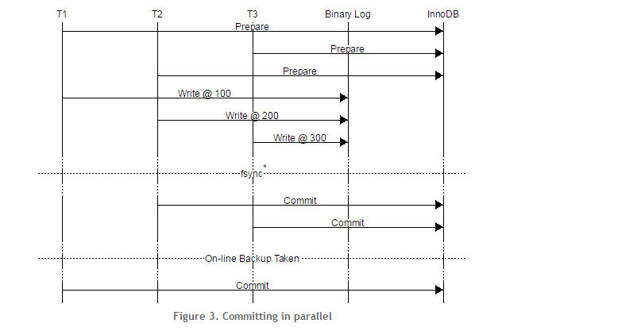

source: http://mysqlmusings.blogspot.com/2012/06/binary-log-group-commit-in-mysql-56.html

translate: web

binary log group commit 
-----------------------

MySQL 5.6 包含新特性binary log group commit  BGC。
这个功能主要是为了提升MySQL二进制日志的性能. 简单来说，通过按组写二进制日志方式代替之前一个接一个的写入方式 。
在介绍它的细节前，我先简单介绍一下事务是如何写入二进制日志的。
在此前我们先看看如何开启BGC。

什么都不用做。

是的，开启BGC不用任何操作，它对任何存储引擎都是有效的，不用去扩展handlerton 接口来实现BGC。然而InnoDB的一些优化利用了BGC。

binlog_order_commits={0|1}

修改和设置这个全局变量无需停止mysql服务器。

如果是关闭的(0),事务有可能是并行提交的，在一些情况下可能会带来性能的提升。为了测试我们开启了它，虽然吞吐量上并没有明显的提升，
但我们仍决定开启它，说不定在哪些特定情况下它可以发挥作用。

binlog_max_flush_queue_time=microseconds

(表示在处理BGC之前，保持从flush队列读取事务用的时间)

这不是一个操作超时时间，具体是从flush队列取出二进制日志的频率和将日志写入磁盘需要多久。

大量事务....
--------
服务器执行事务时，它会通过基于每个连接的事务缓存，收集事务改变。如果使用基于 statement 的复制，
statements 将被写入事务缓存，如果复制是基于行(row)的，实际被改变的行被写入事务缓存。一旦事务提交了，
事务缓存被当作一个单一的block被写入二进制日志。这允许每个会话按自己照顺序独立的执行，仅当事务数据写入binlog时，需在binlog上加一把锁。
因为每个会话的事务是隔离的，仅在提交时序列化事务已经足够了。（当然这只是理想情况，根据隔离级别的设置，一个事务可以看到其他事务的改动，
所以你不会这么做除非你准确知道你在做什么，对吧？）

为了保证存储引擎和binlog是同步的，服务器实现了2段式提交协议(2PC)，如上图所示，有一次调用write() 和一次调用 fsync()。

两段式提交的意义在于，保证事务同时在引擎和binlog中，或者都不在，甚至服务器崩溃。2PC要求一旦事务在引擎中准备好了，
事务要么全部提交要么全部回滚，即便服务器崩溃和恢复。

事务提交前必须要落盘，这就是为什么调用 fsync()，它确保了文件写入到磁盘上。

声名狼藉的prepare_commit_mutex
-------------------------
当服务器恢复时，通过访问binlog决定哪些去提交，哪些去回滚，但是如果没有binlog呢？

一般情况下，一次恢复可以回滚所有的准备（prepared）的事务，回滚准备但没提交的事务是安全的。
他们仅仅是把数据库移动到开始执行那些事务的状态。任何连接的客户端没有收到事务被提交的显示，
所以他们就知道了需要重新执行事务。

另外一个恢复使用的场景，是在使用在线备份方法时，例如InnoDB的Hot Backup(这是MySQL企业版备份中使用的功能)。
这些工具直接复制了数据库文件和事务日志，这是一个简单的备份方式，但是它意味着包含事务的事务日志都是住在准备的状态（prepared）。
当恢复时，通过回滚所有的事务，保证数据的一致性。

在线备份技术经常用于创建新的slave实例，最后提交的事务在binlog的位置，写在InnoDB redo log头部。
恢复过程中，你可以用`CHANGE MASTER` 命令指定复制的起始位置到最后提交的事务在binlog的位置。为了实现这样的功能，
所有的事务提交的顺序必须和写入binlog的顺序相同，如果不是这样，写入binlog的事务中会有"空洞"，会导致从库丢失那些没有提交的事务。

这个问题可能出现的情况可以从下图中看到：

Figure 2中，复制从最后提交的位置开始，但是有一个准备的事务，因此salve启动时有一个回滚。

为了解决这个问题，InnoDB 加入了一个mutex(互斥锁） 叫做prepare_commit_mutex ，事务在准备阶段会得到锁，
提交时会释放锁。这是一个很简单的解决方案，但是一些情况下会导致执行时间到分钟级，prepare_commit_mutex 通过强制序列执行
解决这个问题如图Figure 4。

哦不...稳定性
--------
写入磁盘是很慢的，所以每个事务的落盘是很影响性能的，不是非常影响性能。

为了处理磁盘问题，sync_binlog 选项决定了binlog落盘的频率。设为0，由操作系统来决定文件pages什么时间落盘，如果设置为1，
每次把事务写入binlog后会调用 fsync()，一般情况下设置sync_binlog=N，可能会丢失N-1个事务，所以一般都设置为0，表示你容忍数据丢失，
而设为1表示不容忍数据丢失，当然你也可以设为其他值，现实中你不可能同时处理数据丢失或不丢失。

为了提高性能，每次sync会绑定多个write，操作系统就是这么做的，数据库也要这么做，但是图4中可以看到，在序列内没有地方调用fsync()，
在同一时刻有多个事务写入磁盘，为什么，因为在序列的任意点上，至少有一个准备的和写完的事务。再回顾图3，你会发现在事务同时写入磁盘时，
是有可能放入一个fsync()的，如果可以，那么fsync()之前的所有写入binlog的事务可以全部一次写入磁盘，但这也意味着如果不使用prepare_commit_mutex，
所有事务提交和写入的顺序必须是一致的。

所以，如何保证这些东西可以工作
---------------
binary log group commit 的实现，把事务提交的过程分割为了几个阶段，如图5，这些阶段只是binlog内部提交过程，并不影响其他东西，。
理论上，通过提交的顺序，可以有另外的一种复制实现。通过分割提交为几个阶段，同一时间可以有多个线程处理事务，这样提高了吞吐量。

每个阶段内，有输入一个队列 队列处理。如果一个线程注册到一个空队列，他被认为是当前阶段的领导者，否则会话是个跟随者，
领导者带领队列内的其他线程,在进入下个阶段时,注册领导者和跟随者。跟随者离开队列，等待领导者发送提交完成的信号，
当一个领导者进入空队列时，他可以选择成为领导者或者成为跟随者，等待新的领导者。跟随者在下个阶段中只能成为跟随者。

当一个leader进入一个阶段, 它从队列里顺序地取出一个线程，让线程去处理。当队列空了,
当leader 处理老队列时，其他会话可以注册到这个阶段里

在flush阶段, 所有注册的线程会把他们的缓存写入binlog。当所有的事务都写入一个内部 I/O 缓存后,
在阶段最后的部分里，会把内存中的缓存写入磁盘(这里写入磁盘的本质是写入文件pages，同样是内存里)。
 
在sync 阶段,根据sync_binlog的配置，来决定binlog 如何同步到磁盘。如果 sync_binlog=1 所有在flush 阶段的flushed在会话都会被依次同步到磁盘.

在commit 阶段, 在这个阶段内注册的会话根据注册的顺序被提交到引擎，所有的工作由本阶段的leader`完成.
因为顺序保存在每个阶段的提交过程中,所以写入和提交的顺序都是相同的.

当 commit 阶段 完成执行后,所有本阶段在队列内的线程被标记为完成,并且会收到一个信号,这样它们可以继续执行.
每个会话会从提交过程返回，继续执行。 

感谢这样的事实，领导者注册到下个阶段，并准备成为跟随者，最慢的阶段将会积累工作的大部分。最典型的就是sync阶段，尤其是写入硬盘。
很难用大量的事务填满flush阶段，所以flush阶段的情况有点特殊。

在flush阶段，leader 会从队列(input 队列)中挨个浏览会话，只要最后一个会话还没有出列，
或者第一个会话未入列的时间大于binlog_max_flush_queue_time ，整个阶段的处理过程就会持续进行。
有2种情况会打断这个过程：
* 队列是空的，leader 会立刻前进到下个阶段，并把所有会话注册到sync阶段的队列
* 达到了超时时间，整个队列取完并且会话的事务缓存flushed，leader会进入到sync阶段

性能，性能，性能...
-----------
我想大家肯定好奇到底有哪些提升，所以我们就看看在实验的基准测试，有许多的改进和binlog没关系，
所以这里只关注那些和binlog有关的改进。如图6，展示了5.6.5版本和5.6实验版的binlog测试，
测试是在 2.00 GHz 48-core Intel® Xeon® 7540 带有 512 GiB内存和 SSD 磁盘的机器上进行的。

可以看到5.6.5的吞吐量的增长是巨大的，从2倍到4倍。从5.6.5到5.6实验版这是一个大幅度的提升，
虽然显示的是服务器整体的状态，但是有趣的是5.6.5的sync_binlog=0 而5.6实验版sync_binlog=1，在带有有log group commit时，
还是有相同的比率，说明实验版的吞吐量有大幅提升。

另一个有趣的方面是，在sync_binlog=1时的性能几乎和sync_binlog=0时相同，在连接数很高时(大于50)，吞吐量的差异是从0%到5%和10%之间,
而连接在较低区间，差异达到20%。这看起来很奇怪，是什么导致了这个问题，有什么方法可以解决呢？

答案来自于开发新特性完成时的一些基准测试，我们使用Sysbench 在一台64-核 Intel® Xeon® X7560 2.27GHz， 126 G内存 ，机械盘的电脑上，

图7是增强版的5.6开启不合不开启binary log group commit基准测试。增强版包含了一些性能提升的特性，
这些特性多数在实验版本而不在DMR版本（Development Milestone Release）中。
所以这个图没法和图6比较，但是可以帮助我们理解为什么连接数很低的情况下会有20%性能的损失。

图7最底下的一条线（绿色）是5.6增强版不开启binary log group commit 并且sync_binlog=1，它的表现很糟糕。
（这很正常，这就是为什么binary log group commit出现的原因），不开启binary log group commit的情况下，
即便sync_binlog=0(红色)，这个阶段提交架构的产物也比老版本的分数高。如果你看看图中其他的线条，
你会发现sync_binlog=1 开启binary log group commit时，在线程(连接)数大约105的之后，
也比不开binary log group commit，sync_binlog=0的时候性能高。

还可以看到，开启binary log group commit，随着连接数的增长，sync_binlog=0与sync_binlog=1 之间的性能差异逐渐缩小，
在连接等于160时，性能相等，我们还没有具体的深入分析原因，但是通过performance schema表，分析在每个不同阶段的性能，
我们发现sync 的时间，支配了性能的表现(不要感到惊讶，这里仅给出背景)，所有的可用事务，在sync 阶段的队列里被挑出来。
一个连接只能有一个正在处理的事务，这就意味着连接数是32时，队列内的事务不可能超过32个，事实上，在经过一定时间后，
肯定会有一半的事务在队列内，而一半的事务处在内部的sync阶段，所以在连接很低的时候，连接数没法填满队列，不以保证有效地使用系统。

结论是，如果减少sync的时间，在低连接数时，无论sync_binlog=0 还是 sync_binlog=1 它们之间性能的差异都会减少，
我们没有在带有电池缓存的磁盘上做基准测试(这样会有效的减少sync的时间)，否则这种情况下的性能表现会很有趣。

总结
---
* binlog 的代码被简化和优化，当使用 sync_binlog=0 性能会提升。
* prepare_commit_mutex 锁从代码中被移除，服务器正确地顺序化事务
* 事务可以按组写入和提交，并且没有事务丢失，sync_binlog=1 and sync_binlog=0都有 3倍的性能提升
* 随着的系统负载的增加，sync_binlog=1 和sync_binlog=0的差异会减小
* 已有的存储引擎无需改变处理接口，直接从 binary log group commi中获益

Binary log group commit是mysql5.6复制一系列改进之一，还有GTID，多线程slave， slave和binlog的安全崩溃，复制校验等等,

你可以从开发区的这篇问题学到更多

dev.mysql.com/tech-resources/articles/mysql-5.6-replication.html

你也可以下载mysql5.6 尝试 Binary log group commit

相关链接
----

[这篇文档](https://www.facebook.com/note.php?note_id=438641125932)开始，指出了这个问题并提出解决方案

第二年，[Kristian Nielsen](http://kristiannielsen.livejournal.com/) 为MariaDB 实现了binary log group commit，
并发表了一系列[好文章](http://kristiannielsen.livejournal.com/12254.html)讲述如何实现的。这个实现中，使用了原子队列，
事务的flush和sync绑在一起，这之后会话收到信号并提交它们的事务。

