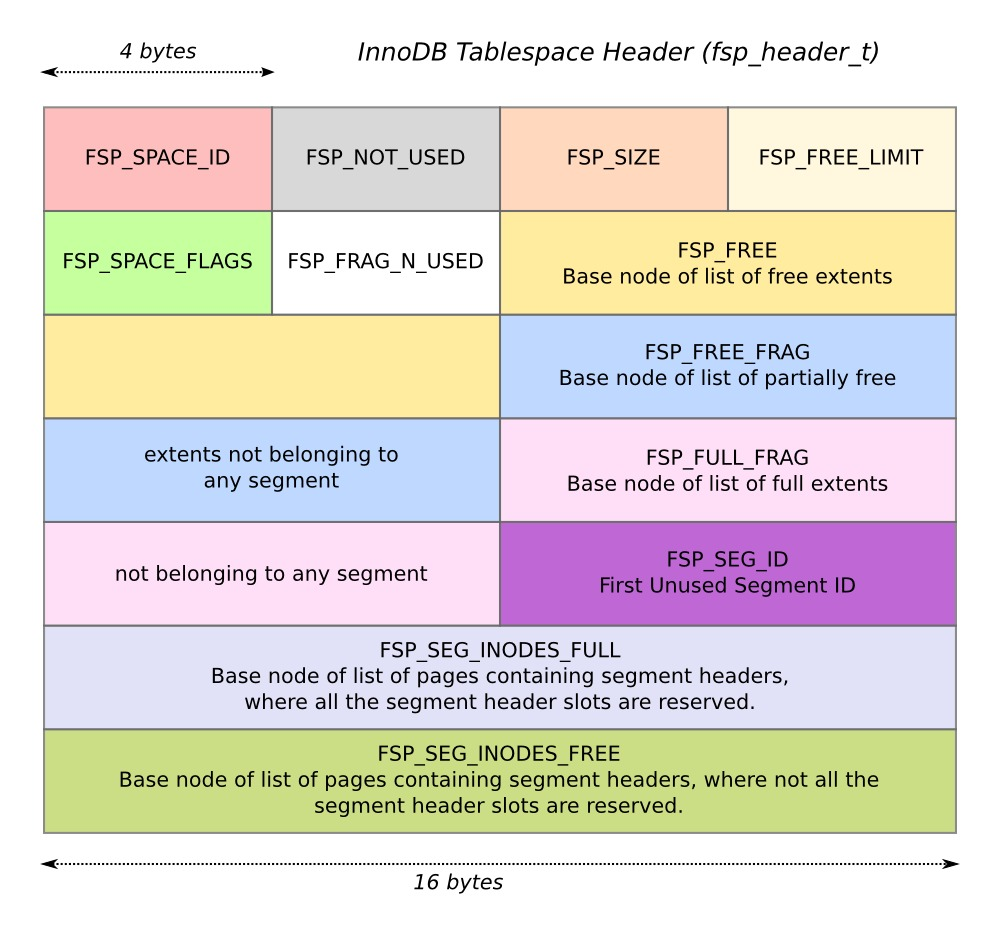

source : https://blogs.oracle.com/mysqlinnodb/entry/data_organization_in_innodb
翻译: web

数据在InnoDB的组织结构
==============

介绍
---
这篇文章主要介绍数据是如何在 InnoDB 存储引擎内组织的。

首先我们看一下InnoDB创建的文件，然后了解一下逻辑数据(如表空间，页，段和扩展)的组织结构。

然后分别解释它们的细节与之间的关系。最后，得到一个关于InnoDB存储引擎的层次结构鸟瞰图。


文件
---
MySQL 将所有的文件都保存在data目录，这个路径可以使用命令行参数-data-dir，或者指定在配置文件。默认情况下，当InnoDB舒适化时，会在data目录创建3个重要的文件 – ibdata1, ib_logfile0 and ib_logfile1。ibdata1 是系统和用户数据保存的文件，ib_logfile0 和 ib_logfile1 是 redo 日志文件.

数据文件 ibdata1 属于系统表空间(表空间id为0，space_id)。系统表空间可以拥有多个数据文件，从MySQL5.6起，只有系统表空间可以拥有多于1个的数据文件。其他的表空间只能有1ge数据文件，并且只有系统表空间可以拥有多个表，其他表空间只能有一个表。

数据文件和redo日志文件代表了内存中的 C 语言structure  `fil_node_t`。


表空间(tablespace)
---------------
默认情况下，InnoDB 仅使用一个表空间，叫做系统表空间，表空间id为0. 不过通过指定innodb_file_per_table 参数也可以使用多个表空间，MySQL5.6中这个参数默认是开启的，就是说每个表都有一个自己的表空间

表空间和数据文件的关系在源码(storage/innobase/fil/fil0fil.cc)的注释里有阐述:

```
A tablespace consists of a chain of files. The size of the files does not
have to be divisible by the database block size, because we may just leave
the last incomplete block unused. When a new file is appended to the
tablespace, the maximum size of the file is also specified. At the moment,
we think that it is best to extend the file to its maximum size already at
the creation of the file, because then we can avoid dynamically extending
the file when more space is needed for the tablespace.
```

其中最后一句话里的动态扩展仅针对redo 日志而不是数据文件。数据文件是动态扩展的，而redo日志是预分配的

尽管表空间可以有多个数据文件，这些文件被认为是链接在一起的一个大文件，所以表空间内文件的顺序是很重要的

页(pages)
--------
一个物理文件逻辑上被分为多个页，第一个数据文件的第一个页被标记为页号0，下一个页的页号为1，如此反复。一个表空间内的页有一个全局唯一标记,页号(page_number)，而每个表空间也有唯一编号(space_id)。
所以InnoDB内的页可以使用(space_id, page_no)来唯一标记，那么InnoDB内任意的位置就可以使用(space_id, page_no, page_offset)来表示，
page_offset 表示指定页的偏移字节数。

来自不同数据文件的页之间的关联，在源码的注释里写道：
```
A block's position in the tablespace is specified with a 32-bit unsigned integer.
The files in the chain are thought to be catenated, and the block corresponding
to an address n is the nth block in the catenated file (where the first block
is named the 0th block,and the incomplete block fragments at the end of files
are not taken into account).A tablespace can be extended by appending a
new file at the end of the chain.
```
这表明，所有数据文件的第一个页页号不是0，只有表空间内第一个数据文件的第一个页的页号才是0。

注释也提到page_no 是32位无符号整数,这是page_no保存在磁盘上的大小。

每个页都有一个头部(page_header_t)，细节请看Jeremy Cole's 的博客[The basics of InnoDB space file layout.](http://blog.jcole.us/2013/01/03/the-basics-of-innodb-space-file-layout/)

扩展(extents)
-----------
一个扩展是大小1M的连续页，定义如下
```
# define FSP_EXTENT_SIZE (1048576U / UNIV_PAGE_SIZE)
```
宏UNIV_PAGE_SIZE是一个编译时间常数，MySQL5.6起它是一个全局变量。扩展内页的数量取决于页的大小，默认情况下页大小16KB，那么一个扩展包含64个页。

页类型
---
一个页可以有多种用途，页的类型表明了页被使用的目的，每个页的类型被保存在页的头文件里，头文件的定义在`storage/innobase/include/fil0fil.h`
下面的表格描述了页类型的用途：

| Page Type         | Description|
| ----------------- | ------------------------- |
| FIL_PAGE_INDEX    | The page is a B-tree node |
| FIL_PAGE_UNDO_LOG | The page stores undo logs |
| FIL_PAGE_INODE    |contains an array of fseg_inode_t objects.|
|FIL_PAGE_IBUF_FREE_LIST|The page is in the free list of insert buffer or change buffer.|
|FIL_PAGE_TYPE_ALLOCATED|Freshly allocated page.|
|FIL_PAGE_IBUF_BITMAP |Insert buffer or change buffer bitmap|
| FIL_PAGE_TYPE_SYS   |System page|
|FIL_PAGE_TYPE_TRX_SYS|Transaction system data|
|FIL_PAGE_TYPE_FSP_HDR|File space header|
| FIL_PAGE_TYPE_XDES  |Extent Descriptor Page|
| FIL_PAGE_TYPE_BLOB  | Uncompressed BLOB page|
| FIL_PAGE_TYPE_ZBLOB |First compressed BLOB page|
| FIL_PAGE_TYPE_ZBLOB2|Subsequent compressed BLOB page|

表空间头部
-----
每个表空间也有一个头部文件`fsp_header_t`,这个数据结构保存在表空间的第一个页内

* 表空间id space_id
* 当前表空间的页数
* 空闲段的列表
* 不属于任何segment填满的扩展的列表
* 不属于任何segment 半填充和未使用的扩展的列表
* 保存segment header的页的列表，segment 节点槽位被保留(页类型FIL_PAGE_INODE)
* 保存segment header的页的列表，segment 节点槽位未被保留(页类型FIL_PAGE_INODE)



通过表空间头部, 我们可以访问表空间内可用的segments的列表。表空间头部占用的空间，由宏`FSP_HEADER_SIZE`定义,
它的大小是16*7 = 112 bytes。

表空间保留页
------
前面提到，InnoDB至少有一个系统表空间，space_id 0，这是一个特殊表空间，伴随着MySQL Server的运行而存在，表空间的前几个页保留给内部使用。
头文件的详细信息可以从`storage/innobase/include/fsp0types.h`查看，下面是简单的介绍

page number | The page name | Description
----------------- | ---------------------- | --------------
0 | FSP_XDES_OFFSET | The extent descriptor page.
1 | FSP_IBUF_BITMAP_OFFSET | The insert buffer bitmap page.
2 | FSP_FIRST_INODE_PAGE_NO |The first inode page number.
3|FSP_IBUF_HEADER_PAGE_NO|Insert buffer header page in system tablespace.
4|FSP_IBUF_TREE_ROOT_PAGE_NO|Insert buffer B-tree root page in system tablespace.
5|FSP_TRX_SYS_PAGE_NO|Transaction system header in system tablespace.
6|FSP_FIRST_RSEG_PAGE_NO|First rollback segment page, in system tablespace.
7|FSP_DICT_HDR_PAGE_NO|Data dictionary header page in system tablespace.

可以看到, 头三个页存在于任意表空间.但后5个页只存在于系统表空间.所以其他表空间仅有3个保留页

当参数 innodb_file_per_table 启用后,每个表有一个表空间和数据文件被创建.函数dict_build_table_def_step()的注释
```
/* We create a new single-table tablespace for the table. 
We initially let it be 4 pages: 
- page 0 is the fsp header and an extent descriptor page, 
- page 1 is an ibuf bitmap page, 
- page 2 is the first inode page, 
- page 3 will contain the root of the clustered index of the 
table we create here. */ 
```

文件段 file segments
-----------------
一个表空间有多个文件段，文件段或者段(segments)是一个逻辑实体，每个段有一个段头部(fseg_header_t)，
它指向一个inode(fseg_inode_t)，节点描述了文件段，段头部保护如下信息：

* 从属的inode的空间
* inode的page_no
* inode的page_offset
* 段头部的长度(字节)

fseg_inode_t 有如下信息

* 属于哪个段的id
* 填满的扩展列表
* 当前段的空闲扩展列表
* 当前段半满/空闲扩展列表
* 当前段的独立页的数组，数组的大小是扩展的一般

当段变大，它会从自己的表空间里取到空闲的页或者扩展。

表
---
InnoDB中，表被创建时，内部会创建聚簇索引(B-tree)，B-tree包含2个段，一个代表非子叶节点，一个代表子叶节点。
源码的文档：
```
In the root node of a B-tree there are two file segment headers. The leaf
pages of a tree are allocated from one file segment, to make them consecutive
on disk if possible. From the other file segment we allocate pages for 
the non-leaf levels of the tree.
```
对于给定的表，B-tree的根页可以从data目录取得，InnoDB中，每个表存在于表空间内部，并且包含一个B-tree索引(聚簇索引)，
索引包含了2个段，每个段有很多扩展，每个扩展包含连续1M的页。

结论
---
文章讨论了InnoDB数据结构的细节，并且讨论逻辑实体如，表空间，页，页类型，扩展，段，表。
并且讨论了它们之间的关系