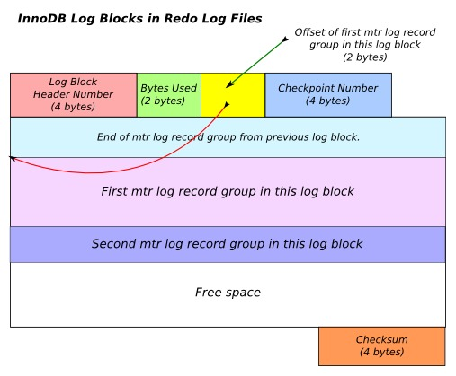

InnoDB Redo Log
----------------
source: https://blogs.oracle.com/mysqlinnodb/entry/redo_logging_in_innodb

翻译： web


介绍
---
InnoDB是一个通用引擎，平衡了性能和可靠性。它是一个事物引擎，完全实现了ACID，如同其他的关系型数据库一样。
可靠性通过redo日志保证。

这篇文章将浏览 InnoDB的 redo log 子系统，先看看如下细节：

* 全局日志系统 提供了访问重要数据结构和信息的能力
* mini-transaction (mtr)，使用了 redo 日志创建的记录
* 全局日志缓存，redo 日志从mini transaction缓存写入这里，缓存里的日志周期性的写入磁盘
* 磁盘上的redo日志是高层次的内部数据结构

我们将讨论LSN的概念，不同值的LSN如何实现write-ahead logging (WAL)。

Redo日志的产生
---------
[Data Organization in InnoDB](https://github.com/liuyangc3/note-book/blob/master/mysql/Data%20Organization%20in%20InnoDB.md)
这篇文章里讲到了，InnoDB数据文件(.idb 文件)被认为是连续的一组页，每个页使用space_id, page_no来标识。
如果我们想读取或者修改一个页，这个页需要被加载到内存里，这样在磁盘和内存里都有了这个页，下面是redo日志生成的大致步骤：

1.任何对页的修改都是先修改内存的页，被修改的内存页并且没有被同步到磁盘时，被标记为脏页。

2.相关的redo日志在内存中生成，在mini transaction (mtr)中。即将被转移到全局redo日志缓存。

3.redo日志记录，从redo日志缓存写入磁盘上的redo日志文件，随后进行flush，这两部分可以认为是分离的，
先写入redo日志文件，再将redo日志文件flush到磁盘，这是因为操作系统上文件是有缓存的。

4.随后的某个时间点，脏页写入磁盘，作为检查点操作的一部分。

这些步骤的顺序非常重要，一个变更的redo日志记录，必须在脏页落盘前落盘。这就是write-ahead logging(WAL)的概念。

生成的redo日志记录会包含一些必要的信息，保证数据库恢复时可以重放相同的操作。所以redo日志记录包含了哪些页被修改了，并且修改了什么内容。
通过redo日志记录，恢复数据库时，没有写入磁盘的脏页，可以重新被"创造"出来。

Redo日志文件
--------
默认情况下InnoDB在data目录创建2个redo日志文件，ib_logfile0 和 ib_logfile1。MySQL 5.6.8 之后，每个文件默认大小是48MB。
大小可以通过`innodb_log_file_size `来修改，文件数量则通过`innodb_log_files_in_group `来修改。

日志组包含了多个相同大小的日志文件，MySQL 5.6仅支持一个日志组，所以这里就不讨论了。

redo日志文件是循环使用的，这意味着先会写入第一个文件，然后写入第二个，知道最后一个文件写满，再从第一个文件写入。

日志文件被视为一组连续的块，被称作”日志块“，块的大小由`OS_FILE_LOG_BLOCK_SIZE`定义,其大小是512字节，每个日志文件有个头部，
大小是`LOG_FILE_HDR_SIZE`，其值是4*OS_FILE_LOG_BLOCK_SIZE=4×512。

Redo日志文件头部
----------
每个日志文件有个头部，占据了4个日志块大小，包含如下信息：

* 前 4 bytes 包含了当前日志的日志组的序号。
* 后 8 bytes 包含了日志文件内数据的起始的LSN。
* 第一个检查点字段位于第二个日志块的起始处。
* 第二个检查点字段位于第四个日志块的起始处。

上面提到的检查点字段包含了一些标识一个检查点的信息，如检查点的序号，检查点的LSN，校验和等。

日志块
---
一个redo日志文件可以认为是一组连续的日志块，除了头部日志块，其他块包含了一个头部和尾部，头部大小是`LOG_BLOCK_HDR_SIZE `(12字节)，
尾部大小是`LOG_BLOCK_TRL_SIZE` (4 bytes). 头部有如下信息：

* 日志块的序号. 4 bytes.
* 当前日志块写入的日志的字节数. 2 bytes.
* 日志块内如果有mtr log record group，记录起始的偏移量，如果没有则为0
* 日志块属于的检查点的序号

尾部是日志块内容的校验和。



Log Sequence Number (LSN)
-------------------------
LSN是一个重要的概念，LSN是redo日志文件内部的一个偏移量，InnoDB内部中LSN类型是type lsn_t,是一个8字节的无符号整数。
LSN有很多有趣的值，下面的表格列出了本篇文件讨论的LSN的值(log_sys 是全局日志系统对象，下一节讨论)

LSN	|Description
----------------- | ---------------------- 
log_sys->lsn| The redo log record that will be generated next will make use of this lsn
log_sys->flushed_to_disk_lsn|The redo log file is flushed upto this LSN. All redo log records whose LSN is < flushed_to_disk_lsn is safely on the disk.
log_sys->write_lsn|There is a currently running write operation which will write upto this LSN.
log_sys->current_flush_lsn|There is a currently running write + flush operation which will write upto this LSN.

LSN 是连接了脏页，redo日志记录和redo日志文件的东西。
当每个redo日志记录拷贝到内存的日志缓存时，得到一个关联的LSN。
当一个页被修改后，redo日志记录就生成了。所以每个页页关联一个LSN，页LSN保存在页头部
页LSN给出了另一个LSN，这个LSN取决于在flush页前，被flush的redo日志文件

全局日志系统对象
--------
Global Log System Object，log_sys(type log_t)，保存了InnoDB日志子系统的重要相关信息。
这里仅仅讨论与redo日志缓存和redo日志文件有关的内容，全局log_sys定义了日志缓存的"活动区域"，
这个区域包含了没有安全写入磁盘的redo日志，同时log_sys还定义了redo日志文件的区域，这个区域内将会写入或者flush入日志缓存的活动区域。

```
/** Redo log buffer */
struct log_t{
	lsn_t		lsn;		/*!< log sequence number */
	ulint		buf_free;	/*!< first free offset within the log
					buffer */
	byte*		buf_ptr;	/* unaligned log buffer */
	byte*		buf;		/*!< log buffer */
	ulint		buf_size;	/*!< log buffer size in bytes */
	ulint		max_buf_free;	/*!< recommended maximum value of
					buf_free, after which the buffer is
					flushed */

	ulint		buf_next_to_write;/*!< first offset in the log buffer
					where the byte content may not exist
					written to file, e.g., the start
					offset of a log record catenated
					later; this is advanced when a flush
					operation is completed to all the log
					groups */
	lsn_t		write_lsn;	/*!< end lsn for the current running
					write */
	ulint		write_end_offset;/*!< the data in buffer has
					been written up to this offset
					when the current write ends:
					this field will then be copied
					to buf_next_to_write */
	lsn_t		current_flush_lsn;/*!< end lsn for the current running
					write + flush operation */
	lsn_t		flushed_to_disk_lsn;
					/*!< how far we have written the log
					AND flushed to disk */
}
```
成员`log_sys->buf`指出内存中的redo日志缓存,mtr_commit()函数将redo日志记录写入这个缓存。
大小为`log_sys->buf_size` 指定的字节数。

成员`log_sys->buf_free`redo日志缓存的偏移量，下一条redo日志记录写入的位置。下一个redo日志写入磁盘的偏移量结束位置。

`log_sys->buf_next_to_write`是没写入redo日志文件的redo日志记录的偏移量，当下次redo日志缓存写入磁盘时，就从这里flush。
这个字段是下一个redo日志写入磁盘的偏移量起始位置。

全局log_sys 对象指向了redo日志缓存和磁盘上的redo日志文件的不同位置，下面的图表示了log_sys 对象指向的位置，清楚的展示了redo日志缓存和redo日志文件的位置映射。


全局内存 Redo Log Buffer
--------------------
redo日志缓存是全局的，所有redo日志都是由用户的事务生成的，最后被写入这个缓存。
缓存的大小可以通过`innodb_log_buffer_size`来设置，默认大小是8MB。

当一个运行的事物正在修改数据库时，会生成redo日志，并填充这个缓存，当事务提交或者缓存满了时，缓存的内容被写入/flush 到redo日志文件。

当缓存满了时，没有足够的空间为提供给mtr_commit()。这个函数会转移一组redo日志记录到缓存，然后调用log_buffer_flush_to_disk()同步flush缓存到日志文件。
mtr_commit 将 log_sys->buf_next_to_write 到 log_sys->buf_free的字节写入缓存。
LSN的方面，log_buffer_flush_to_disk flush redo日志 从log_sys->flushed_to_disk_lsn to log_sys->lsn。

mini transaction (mtr)
----------------------
小事务(mtr)被用来生成redo日志记录，mrt 包含一个本地缓存(叫小事务缓存)，缓存中保存了生成的redo日志记录。
如果我们生成一组redo日志记录，要么全部写入日志文件，要不都不写，那么我们需要吧这些记录放入一个小事务，
除了分离redo日志记录，小事务还脏页的列表。

小事务的使用如下：

* 创建一个类型为mtr_t的小事务对象
* mtr_start() 函数开始小事务，会初始化内部的缓存
* 通过mlog_write_ulint() 家族函数生成redo日志记录
* 通过 mtr_commit()提交小事务，并将redo日志记录从小事务缓存转移到redo日志缓存，脏页的列表添加到buffer pool flush 列表

下面把小事务的结构贴上来，为了您今后的参考，成员 mtr_t::log 包含了小事务缓存，mtr_t::memo 包含了小事务维护的脏页
 
```
/* Mini-transaction handle and buffer */
struct mtr_t{
	dyn_array_t	memo;	/*!< memo stack for locks etc. */
	dyn_array_t	log;	/*!< mini-transaction log */
	unsigned	inside_ibuf:1;
				/*!< TRUE if inside ibuf changes */
	unsigned	modifications:1;
				/*!< TRUE if the mini-transaction
				modified buffer pool pages */
	unsigned	made_dirty:1;
				/*!< TRUE if mtr has made at least
				one buffer pool page dirty */
	ulint		n_log_recs;
				/* count of how many page initial log records
				have been written to the mtr log */
	ulint		n_freed_pages;
				/* number of pages that have been freed in
				this mini-transaction */
	ulint		log_mode; /* specifies which operations should be
				logged; default value MTR_LOG_ALL */
	lsn_t		start_lsn;/* start lsn of the possible log entry for
				this mtr */
	lsn_t		end_lsn;/* end lsn of the possible log entry for
				this mtr */
}
```

Redo日志记录类型
----------
当修改页时，redo日志记录生成，Redo日志记录保存了页内(物理redo日志)被更改的数据信息。
或者保存了如何重现这个更改(逻辑redo日志)。InnoDB 使用了物理和逻辑redo日志的联合体。

为了理解这个概念，请考虑页的重组的操作，如果我们为这个操作生成一个物理的redo日志记录，redo日志记录很可能和页的大小一样。
但是如果为这个操作生成逻辑日记记录，就会减少redo日志记录的大小，为了用逻辑记录代表一个重组的操作我们需要唯一标记一个页。
操作的"类型"就是页的重组。

如果每个redo日志记录有一个类型，那么当数据库恢复时，通过不同类型的记录调用相对应的函数，是非常有用的。
redo日志记录内则需要保存函数的所有参数。

redo日志记录的生命周期
-------------
生命周期的过程如下：

* redo日志记录先是被小事务创建，并保存在小事务的缓存内，日志记录包含了可以在数据库恢复时重放操作必要信息。
* mtr_commit() 结束时，redo日志记录从小事务缓存转移到 全局redo日志缓存。如果有必要，缓存会把redo日志刷到磁盘上，以保证有足够的空间给新的redo日志记录。
* redo日志记录有一个特定的关联LSN，这个关联在 mtr_commit()期间建立的，具体是在小事务缓存转移到 全局redo日志缓存的时候，一旦LSN连接了redo日志记录，lsn在redo日志文件的位置也连接了。
* 当redo日志缓存写入文件和flush后，redo日志记录从redo日志缓存转移到redo日志文件。这意味着redo日志记录持久化到磁盘里了。
* 每个redo日志记录都关联一组脏页，这个关系是通过LSN建立的，在和脏页建立连接前，redo日志记录必须要同步到磁盘。只有脏页同步到磁盘，关联的redo日志记录才能被丢弃。
* redo日志记录可以用来和脏页重新关联，这通常发生在数据库恢复阶段。

结论
---
文章提供了InnoDB存储引擎 日志子系统的 总体观点，redo日志子系统使用的主要数据结构是mrt 小事务，redo日志缓存和redo日志文件。
InnoDB存储引擎追踪了不同的LSN以保证WAL正确的发生。

对于RDBMS系统来说，数据丢失是不允许的，redo日志子系统对RDBMS系统来说是至关重要的，自从redo日志是随着DML操作的同步产生的，
执行的效率也是非常重要的，所以redo日志的大小必须尽可能的小。
