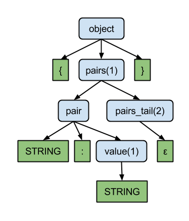
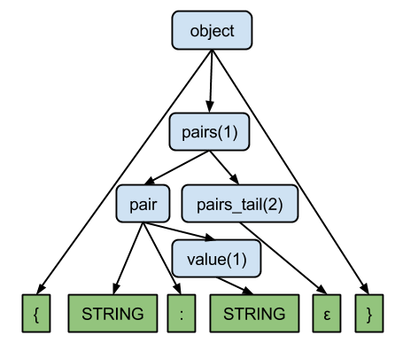

写一篇关于编译基本知识的文章

比如想分析文本
做一个DSL语言


# 词法
token

# 文法 
token 输入流 按照一定规则排列


文法分类

乔姆斯基体系是计算机科学中刻画形式文法表达能力的一个分类谱系，是由诺姆·乔姆斯基于1956年提出的。它包括四个层次：


* 0-型	递归可枚举语言	图灵机	α -> β（无限制）
* 1-型	上下文相关语言	线性有界非确定图灵机	αAβ -> αγβ
* 2-型	上下文无关语言	非确定下推自动机	A -> γ
* 3-型	正则表达式	    有限状态自动机	A -> aB


文法表达
* Formal grammar [形式文法](https://en.wikipedia.org/wiki/Formal_grammar)
* BNF Backus–Naur form [巴科斯范式](https://en.wikipedia.org/wiki/Backus%E2%80%93Naur_form)

形式文法一般写法 S 非终结符
````
S -> aSb|ε
````

# 文法/语法分析器

在分析语法的时候很多人大脑中的一个反映是用正则表达式来做


## 正则表达式 本质是什么
例如下面的正则表达式，表示 a 或 a后面有至少1个b
```
ab*
```

首先这个正则表达式是写给人看的，计算机无法理解

需要把它转化成计算机能理解的结构，这里的结构就是状态机

正则表达式和DFA 确定性有穷自动机（Deterministic Finite Automaton）的转化可以看这本[书](http://www.ituring.com.cn/book/1019)第十章


正则表达式用于语法分析的限制在哪里，看下面的例子
```
a^nb^n
```
可能最接近的写法 `a+b+`


正则表达式不能记录在读到第一个b之前a的个数，但是可以用文法表达
```

S → aAb  
A → aAb|ε 
```

# CFG 
上下文无关文法（Context-Free Grammar）就是下推自动机（Pushdown Automata）能够识别的文法。
跟有限状态自动机（DFA/NFA）相比，多了个栈，有了栈就有了递归能力，可以识别括号表达式（DFA/NFA没有递归能力）
 

什么叫上下文无关
```
aSb -> aaSbb
S -> ab
```

```
（本来）这个方法就是错误的
我有（一本）（来自）美国的杂志
拿我的（笔记本）来
```

##上下文无关文法的解析


一般解析过程是把输入 token 转化为 AST 抽象语法树，
用于表示源程序的数据结构，
树形结构有助于把源代码翻译成机器可执行结构


为了直观表示推导过程，看一个例子
```
json → '{' pairs '}'

pairs → pair pairs_tail | ε
pairs_tail → ',' pairs | ε

// ANTLR support
pairs → pair (',' pairs)* | ε

pair → STRING ':' STRING
```
```
{"message":"Hello, World!"}

经过词法分析
{ STRING : STRING }
```





所以根据生成树形结构循序不同，有两种分析方法
* 自顶向下 对应的解析器 LL， 从左（Left）到右处理输入，左侧推导，右边body替换左边符号
* 自底向上 对应的解析器 LR


look ahead 

例如表达 ab 或 ac， 读到a的位置时，解析器无法判断下一步走哪个分支，
需要在读一个token才能决定
```
A -> ab
   | ac
```
这种额外读取的操作就叫做 look ahead ， 用 LL(k) 表示，也叫做预测分析


## 递归
编写递归下降 recursive-descent parser 的优势

两个特性自顶向下， 推导递归

递归下降 最易于人理解的表达方式


左递归

LL(1) 解析器不支持左递归, 比如下面这种最简的左递归文法：
```
A -> Ab  (规则1)
   | a   (规则2)
```

因为规则1中含有左递归，分析器在读入第1个字符的时候，会递归下降寻找规则1的最左侧的终结符，但显然陷入了一个无限展开的死循环：
```
A -> Ab -> Abb -> Abbb -> Abbbb......
```

使用 B 消除左递归
```
A -> aB
B -> bB
   | ε
```

所以 LL(1) 是要求无回溯的，为了实现无回溯，就要求分析器在每次读入一个符号的时候都能对其作出正确的展开。


[](https://github.com/liuyangc3/nginx_config_parser/blob/master/ngx/grammar_parser.py)

# 上下文相关
CFG 无关的问题在于
```
a^nb^nc^n
```

你可能会写出下面的上下文无关文法
```
aaabbbccc

S -> ABC
A -> aA
   | a
B -> bB
   | b
C -> cC
    | c   
```
lookahead 不能是 n 个

PEG Parse Expression Grammar

PEG 支持的 lookahead 是无限的, 而所有 LL/LR/GLR 生成器支持的 lookahead 都是有限的.


# 业界一些实践

Lex/Yacc(LALR) Look-Ahead LR

ANTLRv3 LL(*) 

ANTLRv4 ALL(*) Adaptive LL(*) 

lpeg PEG https://github.com/liuyangc3/nginx_config_parser/blob/lua/parser.lua

PLY LALR(1)

# ref
ALL(*) http://www.antlr.org/papers/allstar-techreport.pdf

http://blog.reverberate.org/2013/07/ll-and-lr-parsing-demystified.html

https://en.wikipedia.org/wiki/Comparison_of_parser_generators

http://blog.reverberate.org/2013/07/ll-and-lr-parsing-demystified.html
