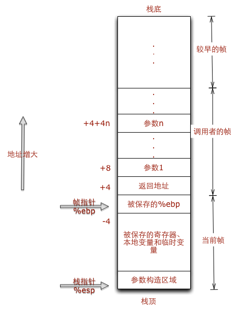

from https://www.python.org/dev/peps/pep-0339/
>Historically, this is not how a standard compiler works. The usual steps for compilation are:
 1.Parse source code into a parse tree (Parser/pgen.c)
 2.Transform parse tree into an Abstract Syntax Tree (Python/ast.c)
 3.Transform AST into a Control Flow Graph (Python/compile.c)
 4.Emit bytecode based on the Control Flow Graph (Python/compile.c)
 
 源码到字节码大致的流程是：
 ```
 source code --> parse tree --> Abstract Syntax Tree(AST) --> Control Flow Graph(CFG) --> bytecode
 ```
 bytecode 写入到 .pyc 文件, Python virtual machine(PVM) runs bytecode, 
 实际上PVM运行的是 PyCodeObject , bytecode 是其磁盘序列化的保存形式。
 
source to parse tree
-----------
parse trees 保存在 ST objects， Python 提供了 parser 模块, 我们先看下面的代码
```
>>> st = parser.expr('1 + 2')
>>> code_object = st.compile()
>>> eval(code_object)
3
```
parser.compilest 或者 st.compile 方法的执行流程和内置方法 compile 相同，所以这里它等价于
```
compile('1 + 2', 'file', 'eval')
```
通过解释器里运行下面的代码可以更清晰地理解
```
>>> st = parser.expr('1 + 2')
>>> eval(parser.compilest(st))
3
>>> eval(st.compile())
3
>>> eval(compile('1 + 2', 'file', 'eval'))
3
```
通过parser.st2list或者 st.tolist()方法可以得到一个代表语法树的列表
```
>>> st.tolist() # or parser.st2list(st)
[
 258,
 [327, [304, [305, [306, [307, [308, [310, [311, [312, [313, [314, [315, [316, [317, [318, [2, '1']]]]],
 [14, '+'], 
 [315, [316, [317, [318, [2, '2']]]]]]]]]]]]]]]],
 [4, ''],
 [0, '']
]
```
列表的第一个元素指出里语法器的类型， 可以从 Include/graminit.h 或者 symbol 模块查看含义，
其他附加元素代表了输入的字符串的组件， 它和父元素的格式一致。

例如附加元素 [14, '+']， 14 关联语法分析器里所有的 `NAME` token 的其中一个token，14是其数字值
例如 [14, '+']， 可以从模块token查看其含义。

source code to ast
----------
ast.parse 得到语法树，
```python
>>> source = """def add(x, y):
    z = 3
    return x + y + z
"""
>>> node = ast.parse(source)
>>> ast.dump(node)

Module(
    body=[
        FunctionDef(
            name='add',
            args=arguments(
                args=[Name(id='x', ctx=Param()),Name(id='y', ctx=Param())],
                vararg=None,
                kwarg=None,
                defaults=[]
            ), 
            body=[Assign(targets=[Name(id='z', ctx=Store())],
            value=Num(n=3)),
            Return(value=BinOp(
                        left=BinOp(left=Name(id='x', ctx=Load()),
                        op=Add(),
                        right=Name(id='y', ctx=Load())),
                        op=Add(),
                        right=Name(id='z', ctx=Load()))
        )
    ],
    decorator_list=[])]
)
```
可以清楚的看到整个语法树的结构，Return对象里可以看出Python是优先进行左值计算的

前面提到过 compile 函数，它负载把源码或者 ast 编译为 code object，eval 函数可以执行code object
```python
>>> codeobj = compile(node, '<string>', 'exec')
>>> eval(codeobj)
>>> add(1, 2)
6
```
code object 在C结构是
```c
typedef struct {
    PyObject_HEADint co_argcount;       /* 位置参数个数 */
    int co_nlocals;                     /* 局部变量个数 */
    int co_stacksize;                   /* 栈大小 */
    int co_flags;PyObject *co_code;     /* 字节码指令序列 */
    PyObject *co_consts;                /* 所有常量集合 */
    PyObject *co_names;                 /* 所有符号名称集合 */
    PyObject *co_varnames;              /* 局部变量名称集合 */
    PyObject *co_freevars;              /* 闭包用的的变量名集合 */
    PyObject *co_cellvars;              /* 内部嵌套函数引用的变量名集合 *//* The rest doesn’t count for hash/cmp */
    PyObject *co_filename;              /* 代码所在文件名 */
    PyObject *co_name;                  /* 模块名|函数名|类名 */
    int co_firstlineno;                 /* 代码块在文件中的起始行号 */
    PyObject *co_lnotab;                /* 字节码指令和行号的对应关系 */
    void *co_zombieframe;               /* for optimization only (see frameobject.c) */
} PyCodeObject;
```
结构体的成员可以通过 code object的属性来访问，例如
```python
>>> codeobj.co_consts
(<code object add at 00000000031ECAB0, file "<string>", line 1>, None)
>>> codeobj.co_filename
'<string>'
>>> codeobj.co_nlocals
0
>>> codeobj.co_argcount
0
>>> codeobj.co_name
'<module>'
>>> codeobj.co_names
('add',)
>>> codeobj.co_firstlineno
1
>>> codeobj.co_consts
(<code object add at 0000000003B11EB0, file "<string>", line 1>, None)
>>> codeobj.co_code
'd\x00\x00\x84\x00\x00Z\x00\x00d\x01\x00S'
```
codeobj.co_name 可以看到当前的 code object 是个模块，codeobj.co_names 里显示了模块内其他的 code obejct，我们的add 函数也被编译成 code object了。

codeobj.co_consts 元组里存放了这些内置的 code object，第一个元素应该就是函数 add 的 code object，我们来开看看
```python
>>> func = codeobj.co_consts[0]
>>> func.co_name
'add'
>>> func.co_code
'd\x01\x00}\x02\x00|\x00\x00|\x01\x00\x17|\x02\x00\x17S'
>>> func.co_consts
(None, 3)
```
co_code 是指令序列，是一串二进制流,用于PVM执行,可以用dis模块可以解析 co_code


opcode	oparg	opcode	opcode	oparg	…
1 byte	2 bytes	1 byte	1 byte	2 bytes

```python
>>> dis.dis(codeobj)
  1           0 LOAD_CONST               0 (<code object add at 0000000003B11EB0, file "<string>", line 1>)
              3 MAKE_FUNCTION            0
              6 STORE_NAME               0 (add)
              9 LOAD_CONST               1 (None)
             12 RETURN_VALUE        
             
>>> dis.dis(func)
  2           0 LOAD_CONST               1 (3)
              3 STORE_FAST               2 (z)

  3           6 LOAD_FAST                0 (x)
              9 LOAD_FAST                1 (y)
             12 BINARY_ADD          
             13 LOAD_FAST                2 (z)
             16 BINARY_ADD          
             17 RETURN_VALUE    
```
* 第一列表示以下几个指令在py文件中的行号
* 第二列是该指令在指令序列co_code里的偏移量;
* 第三列是指令 opcode 的名称，分为有操作数和无操作数两种，opcode 在指令序列中是一个字节的整数;
* 第四列是操作数 oparg，在指令序列中占两个字节，基本都是co_consts或者co_names的下标;
* 第五列带括号的是操作数说明。


Python 在加载模块时(import), 会将模块文件编译对应的 code object 写入到 .pyc 文件，
.pyc 文件是字节码对象（PyCodeObject）在硬盘上的表现形式.

pyc
----

一个 pyc 文件包含了三部分信息：Python 的 magic number、pyc 文件创建的时间信息，以及 PyCodeObject 对象。

magic number 是一个整数值。不同版本的 Python 实现都会定义不同的 magic number，这个值是用来保证 Python 兼容性的。
比如要限制由低版本编译的 pyc 文件不能让高版本的 Python 程序来执行，只需要检查 magic number 不同就可以了。
由于不同版本的 Python 定义的字节码指令可能会不同，如果不做检查，执行的时候就可能出错。

创建时间用来和 py 文件修改时间进行对比，如果py修改时间较新，则需要重新编译 .pyc，否则直接加载.pyc

PyCodeObject 对象 被Python虚拟机用来执行执行字节码使用。

我们可以通过下面的方式 生成 pyc 文件
```python
import imp

def generate_pyc(name):
    fp, pathname, description = imp.find_module(name)
    try:
        imp.load_module(name, fp, pathname, description)    
    finally:
        if fp:
            fp.close()
```

run in PVM
---------
Python 虚拟机会从编译得到的 PyCodeObject 对象中依次读入每一条字节码指令，X86的运行时栈帧如下图：



当代码运行时，会创建一个栈帧Frame，每当有函数调用时，会在继续创建新的栈帧，栈帧在 Python 中的实现就是PyFrameObject对象。

```c
typedef struct _frame {
    PyObject_VAR_HEADstruct _frame *f_back;    /* 调用者的帧 */
    PyCodeObject *f_code;     /* 帧对应的字节码对象 */
    PyObject *f_builtins;     /* 内置名字空间 */
    PyObject *f_globals;      /* 全局名字空间 */
    PyObject *f_locals;       /* 本地名字空间 */
    PyObject **f_valuestack;  /* 运行时栈底 */
    PyObject **f_stacktop;    /* 运行时栈顶 */
    ...
```
栈帧对象里保存了 code object 和 作用域范围变量

我们可以通过sys._getframe()得到运行时当前的栈帧，例如下面的例子
sys._getframe().f_globals 等同于 globals(), sys._getframe().f_locals 等同于 locals()

```pyhton

def show_frame():
    v = 20
    frm = sys._getframe()
    print frm.f_locals
    # code object
    co = frm.f_code
    print co.co_name
    
>>> show_frame() 
{'v', 20, 'frm': <frame object at 0x0000000003256708>}
show_frame
```

```
code="""s = "hello "
def say_hello(name):
    print s + name
say_hello()
"""
co = compile(code, 'test.py', 'exec')
dis.dis(co)
  1           0 LOAD_CONST               0 ('hello ')
              3 STORE_NAME               0 (s)        

  2           6 LOAD_CONST               1 (<code object say_hello at 00000000032577B0, file "test.py", line 2>)
              9 MAKE_FUNCTION            0
             12 STORE_NAME               1 (say_hello)

  4          15 LOAD_NAME                1 (say_hello)
             18 CALL_FUNCTION            0
             21 POP_TOP             
             22 LOAD_CONST               2 (None)
             25 RETURN_VALUE
```
对应的code object 
```
>>> co.consts
('hello ', <code object say_hello at 00000000032577B0, file "test.py", line 2>, None)
>>> co.co_names
('s', 'say_hello')
```

我们具体来看看PVM如何运行字节码，运行时首先会创建一个 frame，我们这里叫它 main
```
s = 'hello '
1       0 LOAD_CONST       0 ('hello ')  # 将co.consts下标0的元素入栈， main
        3 STORE_NAME       0 (s)         # 将上一步的'hello '出栈，以 co.names[0]为key 存入入locals，即 main->f_locals['s'] = 'hello '

def say_hello(name):print s + name 
2       6 LOAD_CONST       1 (<code object say_hello at 00000000032577B0, file "test.py", line 2>)
        # 这里取出 co.consts[1] ，即 say_hello 字节码对象入栈
        9 MAKE_FUNCTION    0  # 创建 function object 入栈
        12 STORE_NAME      1 (say_hello) 
        # 以 co.names[1]为key，function object出栈为值，存入locals，即 main->f_locals['say_hello'] = function object

say_hello()
4      15 LOAD_NAME                1 (say_hello)  # main->f_locals['say_hello'] 入栈
       18 CALL_FUNCTION            0  # 调用函数，创建新的栈帧
       21 POP_TOP                     # 函数返回值出栈
       22 LOAD_CONST               2 (None)  # None 入栈
       25 RETURN_VALUE                       # None 出栈 return None
```
从侧面也说明了 CPython 是基于栈的


参考
-----

https://docs.python.org/2/library/parser.html#parser.sequence2st

https://docs.python.org/2/library/token.html#module-token

https://docs.python.org/2/library/symbol.html#module-symbol

http://eli.thegreenplace.net/2009/11/28/python-internals-working-with-python-asts

http://tech.uc.cn/?p=1932


 
 