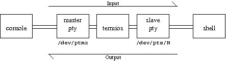

# 历史回顾


http://pubs.opengroup.org/onlinepubs/7908799/xsh/termios.h.html
http://pubs.opengroup.org/onlinepubs/7908799/xbd/termios.html

http://tldp.org/HOWTO/Serial-Programming-HOWTO/
## Early Unices: Seventh Edition Unix 早期 Unix
由  Unix 32V 和 Seventh Edition Unix, 以及 BSD version 4 提供的 terminal 接口，被认为是老的 terminal 驱动，
有三种 imput 模式:
* line mode (也叫 "cooked" mode)
行模式，terminal 驱动每次返回一行的数据

* cbreak mode
2种字符模式之一，每次返回一个字符，允许控制字符

* raw mode
2种字符模式之二，每次返回一个字符，完全禁止控制字符。

这类接口里都是通过 ioctl 修改 input 模式和控制字符。

## System III and System V
上面提到过，在 BSD Unix 里，input 模式是通过 ioctl() 来读取和设置的，并且有特定函数用来读取和设置特殊字符。
而 System III Unix 则设计了全新的接口，不同于 BSD，它将 flag 和特殊字符的控制捆绑了到了一个叫 termios 的 stuct，这样可以通过一次操作来设置它们。

System III 的接口不支持 job control，取消了 "cooked", "cbreak", and "raw" 模式，并且把特殊字符的处理从 input 模式里独立出来，
只设置两种 input 模式: canonical 和 non-canonical 模式，System V 也沿用了这个设计。


Linux 实现
```c
struct termios {
    tcflag_t c_iflag;      /* input modes */
    tcflag_t c_oflag;      /* output modes */
    tcflag_t c_cflag;      /* control modes */
    tcflag_t c_lflag;      /* local modes */
    cc_t     c_cc[NCCS];   /* special characters */
}
```

* canonical mode

通过设置 c_lflag 为 ICANON 进入此模式，the terminal 驱动返回一行的数据 ，特殊字符也发送到设备，如(^C, ^Z, etc.).
这是行模式，每次处理一行，允许行编辑，当行分隔符出现(NL, EOL, EOL2; 或在行首出现 EOF)时，返回buffer内的行数据。

* non-canonical mode

字符模式，不允许行编辑，特殊字符不被处理，vim使用这个模式。返回字符的时机有由 MIN 和 TIME 值控制。
在这个模式下，如果文件描述符设置了 O_NONBLOCK , 无论 MIN 或 TIME 的值是什么， read() 可能会立刻返回。
因此。如果没有数据时, POSIX 允许 noncanonical 模式下的 read() 返回0或-1，并将errno设置为EAGAIN。

## POSIX 标准
虽然都是 UINX，但不同的产品提供了不同的 ioctl() 操作,有不同的 (symbolic) 名称, 不同的 flags。
为了解决 ioctl 使用的混乱，POSIX 使用了 System V Unix 的 termio 数据结构作为模板，并引入了 job control，即暂停和延迟暂停的特殊字符。

下面介绍 Termios

# A Brief Introduction to Termios
如果你是一个 UNIX 终端用户，很多终端行为你认为理所当然，但你肯定没有认真的思考过。
比如按下 `^C` 和 `^Z` (不是在vim or emasc的编辑环境里) 可以杀死和暂停前台程序.
也许你知道 shell 使用 libreadline 来实现行编辑，但是当你在终端界面按下 cat， 字母出现在屏幕时，是谁在提供这些功能?
 
这些都是 Unix terminal 层来实现的，termios 接口在通信的设备间同步数据。
 
## The terminal device
Unix 中与终端的交互都抽象成为与 'terminal' 设备交互，简写为 `tty`。在今天，你是不会和一个物理终端交互的，一般都是和"伪终端"(pseudo-terminal)交互。

伪终端是一个纯虚拟结构，简称'pty'，单来说它是一对 endpoints (具体实现为 /dev 下的字符设备)，这对儿 endpoints 提供了一个双向的通信通道。
无论从哪一个 endpoint 写入，数据都可以从另一个 endpoint 读出，反之亦然。

这对儿 endpoints 通常叫做 "master" 端和 "slave" 端，与 pipe 和 socket 不同，它们并不是直接传递数据。
所以终端设备特别之处是，在 master 和 slave 之间，有一个中间层可以用来过滤，转发，回应两段的数据流。

通常 master 是连接你的终端模拟器(如 xshell, secureCRT)的一端，而 slave 是目标处理程序(例如 shell)。

"输入"数据会从用户终端模拟器 到 master 再到 slave，"输出"则从 程序 到 slave 再到 master，基本的过程如下所示:



这幅图简化了许多过程，但表达主要的过程。

## What happens in the middle?
中间的方块我标记为 "termios"，就是第一段里提到中间层，主要行为如下:
* Line buffering – 当字符从左侧进入,它会保存直到收到换行,同时把整行一次性发送出去。
* Echo – 当字符从左侧进入, 除了保存到 Line buffering,它会把字符返回到左侧，这就是为什么你会看到你打的字。
* Line editing – 当 ERASE 字符 (^?, ASCII 默认为 0x7f)从左侧进入，假设输入缓冲有内容，最后一个字符会被删除，
 并且序列 "\b \b" 发送到左侧。"\b" (ASCII 0x08) 是告诉你的终端把游标往左移动一格(删除键)，具体是先往左移动一格，
 将光标所在字符替换为空格，再把光标移动回去。
* Newline translation – 如果换行("\n", ASCII 0x0A) 进入右侧，一个 carriage-return/line-feed  (CRLF, "\r\n", ASCII 0x0D 0x0A)
发送到左侧，大多 UNIX 程序接受 "\n" 为换行，你的终端将需要两种 - "\r" 把游标移动到行首，"\n" 把游标移动到下一行。
* Signal generation - 生成信号，如果 `INTR` (^C, ASCII 0x3) 进入左侧，信号被丢弃，然后 `SIGINT` 发送到右侧的程序，
同样的，`SUSP` (^Z, ASCII 0x1A) 进入左侧，一个 `SIGTSTP` 会到右侧的程序(SIGTSTP 默认是停止一个进程，它和 SIGSTOP 的主要区别是
它可以被程序捕获和处理，而 SIGSTOP 是无条件的)。 

除了图中的还有2种特殊情况：

"termios" 并不是严格地在中间，它也知道右侧的程序，也可以和程序交互而不仅仅是把字符发给 slave。
    
salve 可以连接多个程序，但是哪个才允从中去读？应该把 SIGINT 或 SIGTSTP 发个谁？这个答案非常复杂，我并不是完全了解，
但我知道一些基本原则。这在下篇文章里会讲。

## Termios(3) and Stty
这一节我们看看  "termios" 控制行为的接口，如果右侧程序使用了 curses (如vim or emacs)，或者仅仅用了 readline(如 bash)，
就可以自定义一些行为了。

termios 主要的编程接口是 `struct termios`  和 2个函数:
```c
int tcgetattr(int fd, struct termios *termios_p);
int tcsetattr(int fd, int optional_actions,
             const struct termios *termios_p);
```
他们检索和设置 `struct termios` 所关联的终端设备。这些东西都文档化在 `termios(3)`。

关于 `struct termios` POSIX 规定了这个结构至少包含如下成员:
```c
tcflag_t c_iflag;      /* input modes */
tcflag_t c_oflag;      /* output modes */
tcflag_t c_cflag;      /* control modes */
tcflag_t c_lflag;      /* local modes */
```
每个 "flag" 成员都包含一组标志位(bitmask 实现)，每个标志位可以单独的开启或关闭。
c_iflag 和 c_oflag 包含的标志位们影响输入和输出的处理，c_cflag 我们通常会忽略，
他的设置和一些过时的东西如串行线路，modem 的控制有关。c_lflag 也需是最有趣的，
它控制 tty 的 board-scale 行为，我们来看看几个有趣的 bit 位:

### local mode
* ICANON - 它也许是 c_lflag 最重要的标志位，开启它会打开 "canonical" 模式 - 也就是行编辑模式，
关闭它，输入会立刻对程序可用(也就是 cbreak 模式)
* c_lflag 的 ECHO 控制了输入是否立刻回显到屏幕，它和 ICANON 是独立的，虽然他们经常一起关闭或开启。
当 passwd 提示你输入密码时，你的终端进入 "canonical" 模式 但 ECHO 是关闭的。
* ISIG 控制了 ^C 和 ^Z 等等是否产生信号，关闭后直接传递字符串而不是用信号代替。 

### input and output modes
c_iflag 和 c_oflag 也有值得一看的:
* c_iflag IXON 开启  "flow control"， 由 ^S 和 ^Q (默认)。开启 IXON，当 master 收到 ^S，
slave 将不接受任何输出(写入它会卡住)，直到 ^Q 被 master 接收。
* c_iflag IUTF8 在 canonical 模式，退格键需要删除之前的缓冲区字符，非 ASCII 编码的情况，
一个字符会有多个字节，但终端只会看到流中的一个字节，没有关于编码信息或字符边界。IUTF8 会告诉终端
字符是 utf-8 编码的，这样就可以正确的删除字符了。如果 IUTF8 关闭，键入多字节的字符，当你使用退格键，
仅会删除最后一个字节，留下的是损坏的utf-8字节流。
* c_oflag OLCUC 映射输出的小写到大写。这仅仅是为了当你需要字母看起都都是大写时准备的。

还有很多标志位，例如控制换行和字符删除，这些内容都在 termios(3)。

### c_cc
c_cc 成员里有许多和终端交互的控制字符。例如 ^C and ^Z and `delete`，它们对 termios 的含义并不是硬编码的，
而是定义在 c_cc 数组。

c_cc 以索引来控制，索引所对应的值是字符，
* VINTR – 生成一个 SIGINT (^C by default).
* VSUSP – 生成一个 SIGTSTP (stop the program) (^Z by default).
* VERASE – 删除之前字符. 默认应该是 ^H and ^? 之一(ASCII 0x7f) – 如果你从来没按过 "backspace" 就收到了 ^H ，
你的终端和你的 `struct termios` 将不同意 VERASE的值.
* VEOF – 文件的结尾. 向程序发送当前行，而不用等待 end-of-line，或者发送当前行的第一个字符，这样slave的下次read
 会返回 end-of-file. (^D by default)
* VSTOP and VSTART – ^S and ^Q，停止和开始 output 输出

将任意成员设置为 NULL (0) 将禁用这个特殊控制字符，很多成员仅仅在certain modes(VINTR and VSUS)激活时才有用，
具体是，c_lflag 的 ISIG 开启，除非设置了 IXON，否则 VSTOP and VSTART 将一直忽略。


### Vim
http://invisible-island.net/xterm/ctlseqs/ctlseqs.html#h2-The-Alternate-Screen-Buffer


Xterm 维护了两个 screen buffers，一个是普通screen ，允许你可以滚动查看之前的保存的屏幕输出，
，而另一个就是 alternate screen buffer，它的大小和屏幕一致，所以它没有额外的保存空间，
不能展示历史记录，当 alternate screen buffer 激活后，你就不能滚动屏幕了，Xterm  提供了
control sequences 控制序列来切换2种 buffer。

大多数 full-screen 程序，使用 terminfo 或 termcap 来开启/停止 full-screen 模式，
 smcup 和 rmcup 用于 terminfo，同样的 ti 和 te 用于 termcap

当打开 vim 进程后，会出进入到 vim 编辑屏幕，这个功能归功于 终端的 alternate screen 特性。

http://invisible-island.net/xterm/xterm.faq.html#xterm_tite

Solaris 2.x 时代， terminfo 并没有使用 alternate screen,Solaris 10 开始， ncurses 5.6
为使用alternate screen 的 xterm 提供了一个好用的 terminal description 。

由于 alternate screen 特性在 terminal description里了，这个特性就可以配置了，例如

```
echo " smcup=\E7\E[?47h, rmcup=\E[2J\E[?47l\E8," >> /tmp/xterm.src
```
\E 表示 escape sequence，表示开始 转义序列，16进制是 '\x1b'，后面再加上具体的指令，如：

for smcup
* '\x1b7'  保存 cursor 的位置
* '\x1b[?47h' 切换到 alternate screen

for rmcup
'\x1b[2J' clears  screen 清屏(假设已经在 alternate screen)
'\x1b[?47l' 切换回 normal screen
'\x1b8' 恢复 cursor 的位置.

而 [XFree86 3.9s](http://invisible-island.net/xterm/xterm.log.html#xterm_54) 后，
xterm 实现了另一组不同控制指令(1047, 1048 and 1049)，新指令实现2组控制序列：
* ti 序列：保存 cursor, 切换到 alternate screen,
* te 序列：clear screen，切换到 normal screen, 恢复 cursor

xterm-256color
* '\x1b[?1049h' 切换到 alternate screen
* '\x1b[?1049l' 切换到 normal screen


# 参考

https://en.wikipedia.org/wiki/POSIX_terminal_interface

https://blog.nelhage.com/2009/12/a-brief-introduction-to-termios/

https://blog.nelhage.com/2009/12/a-brief-introduction-to-termios-termios3-and-stty/

https://blog.nelhage.com/2010/01/a-brief-introduction-to-termios-signaling-and-job-control/
