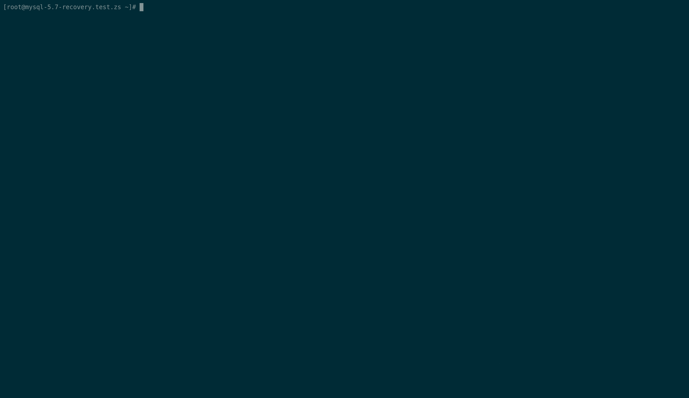
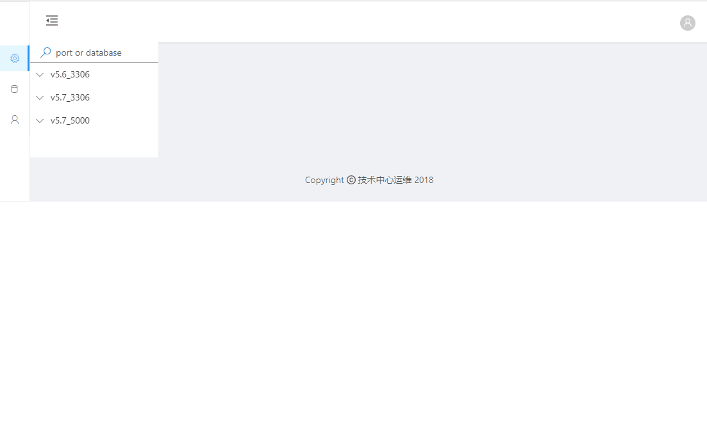
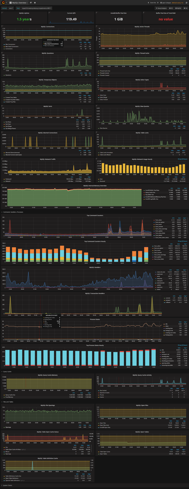

# about me
> 全栈

从网络到服务器到操作系统到代码前后端都会

> 喜欢折腾

web 开发用过 Flask Djongo Tornado SpringBoot beego openresty

语法分析玩过 lex/yacc, ply, ANTLR, lpeg

二次开发过 nginx-module, open-falcon, nginx ingress-controller, Alibaba canal, rpcapd, heka plugin, pmm ...等

写过基于netlink的端口分析工具，基于 libcap/ gopacket 的流量分析工具, mysql 实例管理工具

CI/CD 使用 Jenkins rundeck PM2

运维过 IDC  阿里云 AWS 规模近千台节点

k8s cloud native 体验者

搞过交换机路由器 家用翻墙路由

> 懂算法和数据结构(一些)

做过分享 https://github.com/nxintech/zqh

# some work
mysql 命令管理工具,仿照 kubectl

reactjs web sql ide

PMM

